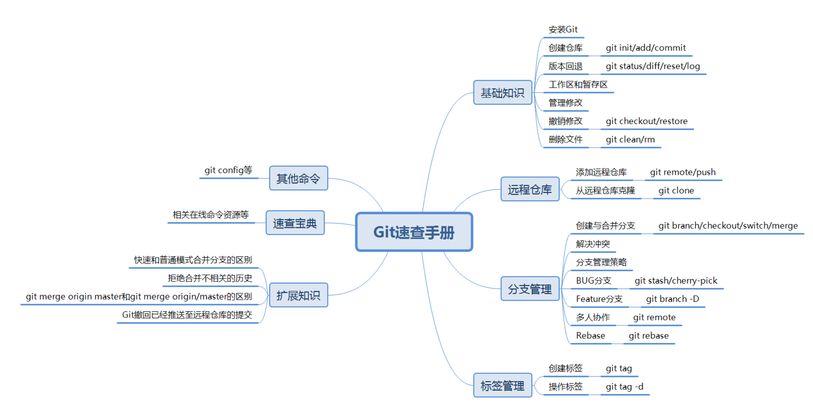

# github基本操作

## 基础知识



### 安装git

**windows上安装**：前往官网下载对应客户端：https://git-scm.com/downloads，默认安装会自动将git添加到系统环境变量

**在Linux上安装**：

```shell
#ubuntu
sudo apt-get install git
#CentOS
sudo yum install git -y
```

**配置**

```shell
git config --global user.name "Your name"
git config --global user.email "xxx@xxx.com"
```

### 创建版本库

初始化本地库：

```shell
git init
```

添加文件到仓库

```shell
#添加单个文件
git add <file>
#添加多个文件
git add file1 file2 ...
#添加全部已修改文件
git add .
```

提交文件到仓库

```shell
git commit -m "说明"
```

版本库又名仓库`repository`，就是一个目录，里面的文件都会被git管理起来。

### 版本回退

git工作区状态

```shell
git status
```

查看全部修改内容

```shell
git diff
```

查看指定文件修改内容

```shell
git diff <file>
```

回退到指定版本

```shell
git reset --hard commit_id
```

回退到上一个版本

```shell
git reset --hard HEAD^
```

回退到上上一个版本

```shell
git reset --hard HEAD^^
```

回退到上n个版本

```shell
git reset --hard HEAD~n
```

查看详细提交历史

```shell
git log
```

查看简化的提交历史

```shell
git log --pretty=oneline
```

查看分支合并图

```shell
git log --graph
```

查看命令历史

```shell
git reflog
```

### 工作区和暂存区

工作区`Working Directory`：就是文件夹的目录

版本库`Repository`：工作区有一个隐藏目录`.git`，这个不算工作区，而是`Git`的版本库。

`Git`的版本库里存了很多东西，其中最重要的就是称为`stage`（或者叫`index`）的暂存区

前面把文件往Git版本库里添加的时候，是分两步执行的：

第一步是用`git add`把文件添加进去，实际上就是把文件修改添加到暂存区；

第二步是用`git commit`提交更改，实际上就是把暂存区的所有内容提交到当前分支。

因为我们创建`Git`版本库时，`Git`自动为我们创建了唯一一个`maste`r分支，所以，现在，`git commit`就是往`master`分支上提交更改。

可以简单理解为，需要提交的文件修改通通放到暂存区，然后，一次性提交暂存区的所有修改。

### 管理修改

**Git跟踪并管理的是修改，而非文件**

Git只能追踪文本文件的改动，比如TXT文件，网页，所有的程序代码等等，比如在第5行加了一个单词“Linux”，在第8行删了一个单词“Windows”。

图片、视频这些二进制文件，虽然也能由版本控制系统管理，但没法跟踪文件的变化，只能把二进制文件每次改动串起来，也就是只知道图片从100KB改成了120KB，但到底改了啥，版本控制系统不知道，也没法知道。

需要注意的是，如果你按照下述方式提交：

```shell
第一次修改->add->第二次修改->commit
```

那么，第二次修改的内容不会被提交

按照下述方式提交，则两次修改都会被提交

```shell
第一次修改->add->第二次修改->add->commit
```

所以，没有add的内容，即使commit之后也不会被提交

### 撤销修改

丢弃工作区的修改（未提交至暂存区）

```shell
# 丢弃指定文件的修改
git checkout -- file
git restore <file>

# 丢弃所有文件的修改
git checkout -- .
git restore .
```

丢弃已添加到暂存区的修改

```shell
# 丢弃指定文件的修改
git reset HEAD <file>
git restore --staged <file>

# 丢弃所有文件的修改
git reset HEAD .
git restore --staged .
```

### 删除文件

删除未添加到暂存区的文件

```shell
#显示将要删除的文件和目录
git clean -n
#删除文件和目录
git clean -df
#删除文件
git clean -f
git rm <file>
```

## 远程仓库

### 添加远程仓库

关联远程仓库

```shell
git remote add origin <url>
# 其中origin是默认的远程仓库名，也可以自行修改
# url可以是ssh链接，也可以是http链接，推荐使用ssh，安全高速
```

删除远程仓库

```shell
git remote rm origin
```

查看远程仓库

```
git remote -v
```

推送提交到远程仓库

```shell
git push origin master
# 一般用于非首次推送
git push -u origin master
# -u参数是将本地master分支与远程仓库master分支关联起来，一般用于第一次推送代码到远程库
```

现在的情景是，你的本地仓库已经有了，但是你必须要有一个远程仓库，才可以使得自己的代码可以让别人来协作开发，也可以作为一个本地仓库的备份。

### 从远程仓库克隆

克隆远程仓库到本地

```shell
git clone url
# url可以是ssh或http，建议使用原生ssh链接，高速安全
```

之前讲的内容都是先有本地库，后有远程库，然后再关联远程库。而一般大多数情形都是先有远程库，然后克隆远程库到本地，再进行工作。

## 分支管理

**说明**

分支就像玄幻小说里面的分身，让一个分身去学习`JavaScript`，另一个分身去学习`Git`，然后合并两个分身之后，这两个分身对你的本体没有任何影响，平时互不干扰，只有在某个特定的时间，两个分身合并了，你就学会了`Git`和`JavaScript`！

好了，言归正传，分支在实际中有什么用呢？假设你准备开发一个新功能，但是需要两周才能完成，第一周你写了50%的代码，如果立刻提交，由于代码还没写完，不完整的代码库会导致别人不能干活了。如果等代码全部写完再一次提交，又存在丢失每天进度的巨大风险。

现在有了分支，就不用怕了。你创建了一个属于你自己的分支，别人看不到，还继续在原来的分支上正常工作，而你在自己的分支上干活，想提交就提交，直到开发完毕后，再一次性合并到原来的分支上，这样，既安全，又不影响别人工作。

那么有的人可能会问了，创建、切换分支会不会很慢，如果文件非常多的话。

这个就不用担心了，Git的分支是与众不同的，无论创建、切换和删除分支，Git在1秒钟之内就能完成！无论你的版本库是1个文件还是1万个文件。

**建议**

1. 多提交，少推送。多人协作时，推送会频繁地带来合并冲突的问题，影响效率。因此，尽量多使用提交命令，减少合并的使用，这样会节省很多时间。
2. 使用Git流`Git Flow`，即多分支结构。
3. 使用分支，保持主分支的整洁。这是我强烈推荐的一点，在分支进行提交，然后切到主分支更新`git pull —rebase`，再合并分支、推送。这样的流程会避免交叉合并的情况出现（不会出现共同祖先节点为多个的情况）。事实上，git合并操作让很多人感到不知所措的原因就是各种原因所产生的交叉合并问题，从而造成在合并的过程中丢失某些代码。保持主分支的整洁能够避免交叉合并的情况出现。
4. 禁用`fast-forward`模式。在拉取代码的时候使用`rebase`参数（前提是保持主分支的整洁）、合并的时候使用`--no-ff`参数禁用`fast-forward`模式，这样做既能保证节点的清晰，又避免了交叉合并的情况出现。

### 创建与合并分支

查看分支

```shell
git branch
```

创建分支

```shell
git branch <name>
```

切换分支

```shell
git checkout <name>
git switch <name>
# switch是2.23版本新增命令
```

创建并切换到该分支

```shell
git checkout -b <name>
git switch -c <name>
```

合并指定分支到当前分支

```shell
git merge <name>
```

删除本地已合并分支

```shell
git branch -d <name>
```

删除远程分支

```shell
git push <远程仓库名> --delete <远程分支名>
```

推送本地分支到远程仓库并在远程仓库创建新分支

```shell
git push <远程仓库名> <本地分支名>:<远程分支名>
```

### 解决冲突

当Git无法自动合并分支时，就必须首先解决冲突。解决冲突后，再提交，合并完成。

解决冲突就是把Git合并失败的文件手动编辑为我们希望的内容，再提交。

查看分支合并图：

```shell
git log --graph
```

> 冲突的产生一般都是这两种情况：
>
> - 远程仓库的代码落后于本地仓库
>
> - 远程仓库的代码远超本地仓库
>
>   > 在你还未提交代码的时候，你的同事已经提交了代码，就会导致远程仓库代码领先于你的代码

冲突是如何表示的

当产生合并冲突时，该部分会以`<<<<<<<`, `=======`和 `>>>>>>>`表示。在`=======`之前的部分是当前分支这边的情况，在`=======`之后的部分是传入分支的情况。

**如何解决冲突**

在看到冲突以后，你可以选择以下两种方式：

- 决定不合并。这时，唯一要做的就是重置`index`到`HEAD`节点。`git merge --abort`用于这种情况。
- 解决冲突。`Git`会标记冲突的地方，解决完冲突的地方后使用`git add`加入到`index`中，然后使用`git commit`产生合并节点。

你可以用以下工具来解决冲突:

- 使用合并工具。`git mergetool`将会调用一个可视化的合并工具来处理冲突合并。
- 查看差异。`git diff`将会显示三路差异（三路合并中所采用的三路比较算法）。
- 查看每个分支的差异。`git log --merge -p <path>`将会显示`HEAD`版本和`MERGE_HEAD`版本的差异。
- 查看合并前的版本。`git show :1:文件名`显示共同祖先的版本，`git show :2:文件名`显示当前分支的`HEAD`版本，`git show :3:文件名`显示对方分支的`MERGE_HEAD`版本。

### 分支管理策略

在实际开发中，我们应该按照几个基本原则进行分支管理：

首先，`master`分支应该是非常稳定的，也就是仅用来发布新版本，平时不能在上面干活；

那在哪干活呢？干活都在`dev`分支上，也就是说，`dev`分支是不稳定的，到某个时候，比如`1.0`版本发布时，再把`dev`分支合并到`master`上，在`master`分支发布`1.0`版本；

你和你的小伙伴们每个人都在`dev`分支上干活，每个人都有自己的分支，时不时地往`dev`分支上合并就可以了。

所以，团队合作的分支看起来就像这样：


`Git`分支十分强大，在团队开发中应该充分应用。

通常，合并分支时，如果可能，Git会用`Fast forward`模式，但这种模式下，删除分支后，会丢掉分支信息。

如果要强制禁用`Fast forward`模式，`Git`就会在`merge`时生成一个新的`commit`，这样，从分支历史上就可以看出分支信息。

合并分支时，加上`--no-ff`参数就可以用普通模式合并，合并后的历史有分支，能看出来曾经做过合并，而`fast forward`合并就看不出来曾经做过合并。

### Bug分支

暂存工作区状态

```shell
git stash
```

查看暂存的工作区状态

```shell
git stash list
```

恢复全部暂存状态，但不删除暂存内容

```shell
git stash apply
```

恢复指定暂存状态，但不删除暂存内容

```shell
git stash apply stash@{<id>}
```

删除暂存内容

```shell
git stash drop
```

恢复暂存状态，同时删除暂存内容

```shell
git stash pop
```

复制一个特定的提交到当前分支

```shell
git cherry-pick <commit_id>
```

修复bug时，我们会通过创建新的bug分支进行修复，然后合并，最后删除；

当手头工作没有完成时，先把工作现场`git stash`一下，然后去修复bug，修复后，再`git stash pop`，回到工作现场；

在master分支上修复的bug，想要合并到当前dev分支，可以用`git cherry-pick <commit_id>`命令，把bug提交的修改“复制”到当前分支，避免重复劳动。

### Feature分支

强制删除分支（会丢失分支上的修改）

```shell
git branch -D <name>
```

**说明**

开发一个新feature，最好新建一个分支；

如果要丢弃一个没有被合并过的分支，可以通过`git branch -D <name>`强行删除。

### 多人协作

查看远程仓库信息

```shell
git remote
```

查看远程仓库详细信息

```shell
git remote -v
```

与远程仓库代码同步

```shell
git pull
# git pull = git fetch + git merge
```

在本地创建和远程分支对应的分支

```shell
git checkout -b branch-name origin/branch-name
git switch -c branch-name origin/branch-name
```

将本地分支与远程仓库关联

```shell
git branch --set-upstream-to <branch-name> origin/<branch-name>
```

推送本地分支到远程仓库

```shell
git push origin <branch-name>
```

**说明**

多人协作的工作模式通常是这样：

1. 首先，可以试图用`git push origin <branch-name>`推送自己的修改；
2. 如果推送失败，则因为远程分支比你的本地更新，需要先用`git pull`试图合并；
3. 如果合并有冲突，则解决冲突，并在本地提交；
4. 没有冲突或者解决掉冲突后，再用`git push origin <branch-name>`推送就能成功！
5. 如果`git pull`提示`no tracking information`，则说明本地分支和远程分支的链接关系没有创建。

这就是多人协作的工作模式，一旦熟悉了，就非常简单。

> - 本地新建的分支如果不推送到远程，对其他人就是不可见的；
> - 在本地创建和远程分支对应的分支，本地和远程分支的名称最好一致；
> - 从远程抓取分支，如果有冲突，要先处理冲突。

**问题**

在这里记录多人协作时可能会遇到的问题

**描述**

> 本地仓库有文件，远程仓库也有文件，但是这两个仓库文件不一致。这时，将本地仓库与远程仓库关联起来，执行`git branch --set-upstream-to <branch-name> origin/<branch-name>`，提示错误：`error：the requested upstream branch 'origin/master' does not exist"`

解决办法：

若直接执行`git pull`会提示：`refusing to merge unrelated histories`

正确做法：

```shell
git pull origin master --allow-unrelated-histories
git branch --set-upstream-to=origin/master master
git push origin master
```

### Rebase变基

变基（衍合）

```shell
git rebase <branch>
```

放弃变基

```shell
git rebase --abort
```

解决冲突之后继续变基

```shell
git rebase --continue
```

**说明**

rebase操作可以把本地未push的分叉提交历史整理成直线；

rebase的目的是使得我们在查看历史提交的变化时更容易，因为分叉的提交需要三方对比。

## 标签管理

发布一个版本时，我们通常先在版本库中打一个标签（tag），这样，就唯一确定了打标签时刻的版本。将来无论什么时候，取某个标签的版本，就是把那个打标签的时刻的历史版本取出来。所以，标签也是版本库的一个快照。

Git的标签虽然是版本库的快照，但其实它就是指向某个commit的指针（跟分支很像对不对？但是分支可以移动，标签不能移动），所以，创建和删除标签都是瞬间完成的。

Git有commit，为什么还要引入tag？

“请把上周一的那个版本打包发布，commit号是6a5819e…”

“一串乱七八糟的数字不好找！”

如果换一个办法：

“请把上周一的那个版本打包发布，版本号是v1.2”

“好的，按照tag v1.2查找commit就行！”

所以，tag就是一个让人容易记住的有意义的名字，它跟某个commit绑在一起。

### 创建标签

新建标签（指向最新的commit_id）

```shell
git tag <tag_name>
```

新建标签（指向特定commit_id）

```shell
git tag <tag_name> <commit_id>
```

查看所有标签

```shell
git tag
```

显示某个标签的详细信息

```shell
git show <tag_name>
```

新建带有说明的标签

```shell
git tag -a <tag_name> -m "说明" <commit_id>
```

### 操作标签

删除指定本地标签

```shell
git tag -d <tag_name>
```

删除指定远程标签

```shell
git push origin :refs/tags/<tag_name>
```

推送一个本地标签

```shell
git push origin <tag_name>
```

推送全部未推送过的本地标签

```shell
git push origin --tags
```