# gin框架

## gin路由

### 基本路由

- gin 框架中采用的路由库是基于httprouter做的
- 地址为：https://github.com/julienschmidt/httprouter

```go
package main

import (
    "net/http"

    "github.com/gin-gonic/gin"
)

func main() {
    r := gin.Default()
    r.GET("/", func(c *gin.Context) {
        c.String(http.StatusOK, "hello word")
    })
    r.POST("/xxxpost",getting)
    r.PUT("/xxxput")
    //监听端口默认为8080
    r.Run(":8000")
}
```

### Restful风格的API

- gin支持Restful风格的API
- 即Representational State Transfer的缩写。直接翻译的意思是”表现层状态转化”，是一种互联网应用程序的API设计理念：URL定位资源，用HTTP描述操作

1.获取文章 /blog/getXxx Get blog/Xxx

2.添加 /blog/addXxx POST blog/Xxx

3.修改 /blog/updateXxx PUT blog/Xxx

4.删除 /blog/delXxxx DELETE blog/Xxx

### API参数

- 可以通过Context的Param方法来获取API参数
- localhost:8000/xxx/zhangsan

```go
package main

import (
    "net/http"
    "strings"

    "github.com/gin-gonic/gin"
)

func main() {
    r := gin.Default()
    r.GET("/user/:name/*action", func(c *gin.Context) {
        name := c.Param("name")
        action := c.Param("action")
        //截取/
        action = strings.Trim(action, "/")
        c.String(http.StatusOK, name+" is "+action)
    })
    //默认为监听8080端口
    r.Run(":8000")
}
```

输出结果：

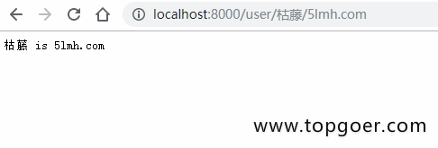

### URL参数

- URL参数可以通过DefaultQuery()或Query()方法获取
- DefaultQuery()若参数不存在，返回默认值，Query()若不存在，返回空串
- API ? name=zs

```go
package main

import (
    "fmt"
    "net/http"

    "github.com/gin-gonic/gin"
)

func main() {
    r := gin.Default()
    r.GET("/user", func(c *gin.Context) {
        //指定默认值
        //http://localhost:8080/user 才会打印出来默认的值
        name := c.DefaultQuery("name", "枯藤")
        c.String(http.StatusOK, fmt.Sprintf("hello %s", name))
    })
    r.Run()
}
```

不传递参数输出的结果：

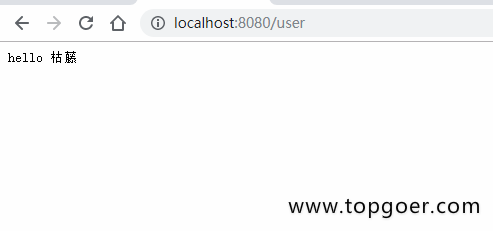

传递参数输出的结果：

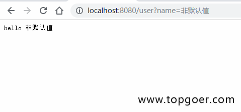

### 表单参数

- 表单传输为post请求，http常见的传输格式为四种：
  - application/json
  - application/x-www-form-urlencoded
  - application/xml
  - multipart/form-data
- 表单参数可以通过PostForm()方法获取，该方法默认解析的是x-www-form-urlencoded或from-data格式的参数

```html
<!DOCTYPE html>
<html lang="en">
<head>
    <meta charset="UTF-8">
    <meta name="viewport" content="width=device-width, initial-scale=1.0">
    <meta http-equiv="X-UA-Compatible" content="ie=edge">
    <title>Document</title>
</head>
<body>
    <form action="http://localhost:8080/form" method="post" action="application/x-www-form-urlencoded">
        用户名：<input type="text" name="username" placeholder="请输入你的用户名">  <br>
        密&nbsp;&nbsp;&nbsp;码：<input type="password" name="userpassword" placeholder="请输入你的密码">  <br>
        <input type="submit" value="提交">
    </form>
</body>
</html>
package main

//
import (
    "fmt"
    "net/http"

    "github.com/gin-gonic/gin"
)

func main() {
    r := gin.Default()
    r.POST("/form", func(c *gin.Context) {
        types := c.DefaultPostForm("type", "post")
        username := c.PostForm("username")
        password := c.PostForm("userpassword")
        // c.String(http.StatusOK, fmt.Sprintf("username:%s,password:%s,type:%s", username, password, types))
        c.String(http.StatusOK, fmt.Sprintf("username:%s,password:%s,type:%s", username, password, types))
    })
    r.Run()
}
```

输出结果：

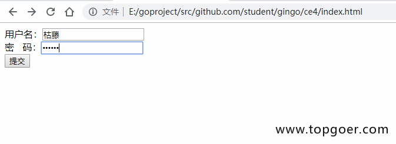

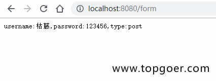

### 上传单个文件

- multipart/form-data格式用于文件上传
- gin文件上传与原生的net/http方法类似，不同在于gin把原生的request封装到c.Request中

```html
<!DOCTYPE html>
<html lang="en">
<head>
    <meta charset="UTF-8">
    <meta name="viewport" content="width=device-width, initial-scale=1.0">
    <meta http-equiv="X-UA-Compatible" content="ie=edge">
    <title>Document</title>
</head>
<body>
    <form action="http://localhost:8080/upload" method="post" enctype="multipart/form-data">
          上传文件:<input type="file" name="file" >
          <input type="submit" value="提交">
    </form>
</body>
</html>
package main

import (
    "github.com/gin-gonic/gin"
)

func main() {
    r := gin.Default()
    //限制上传最大尺寸
    r.MaxMultipartMemory = 8 << 20
    r.POST("/upload", func(c *gin.Context) {
        file, err := c.FormFile("file")
        if err != nil {
            c.String(500, "上传图片出错")
        }
        // c.JSON(200, gin.H{"message": file.Header.Context})
        c.SaveUploadedFile(file, file.Filename)
        c.String(http.StatusOK, file.Filename)
    })
    r.Run()
}
```

效果演示：

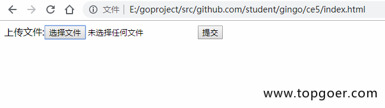

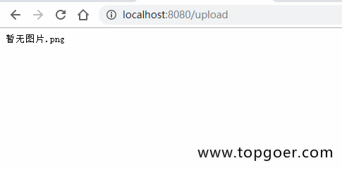

### 上传特定文件

有的用户上传文件需要限制上传文件的类型以及上传文件的大小，但是gin框架暂时没有这些函数(也有可能是我没找到)，因此基于原生的函数写法自己写了一个可以限制大小以及文件类型的上传函数

```go
package main

import (
    "fmt"
    "log"
    "net/http"

    "github.com/gin-gonic/gin"
)

func main() {
    r := gin.Default()
    r.POST("/upload", func(c *gin.Context) {
        _, headers, err := c.Request.FormFile("file")
        if err != nil {
            log.Printf("Error when try to get file: %v", err)
        }
        //headers.Size 获取文件大小
        if headers.Size > 1024*1024*2 {
            fmt.Println("文件太大了")
            return
        }
        //headers.Header.Get("Content-Type")获取上传文件的类型
        if headers.Header.Get("Content-Type") != "image/png" {
            fmt.Println("只允许上传png图片")
            return
        }
        c.SaveUploadedFile(headers, "./video/"+headers.Filename)
        c.String(http.StatusOK, headers.Filename)
    })
    r.Run()
}
```

### 上传多个文件

```html
<!DOCTYPE html>
<html lang="en">
<head>
    <meta charset="UTF-8">
    <meta name="viewport" content="width=device-width, initial-scale=1.0">
    <meta http-equiv="X-UA-Compatible" content="ie=edge">
    <title>Document</title>
</head>
<body>
    <form action="http://localhost:8000/upload" method="post" enctype="multipart/form-data">
          上传文件:<input type="file" name="files" multiple>
          <input type="submit" value="提交">
    </form>
</body>
</html>
package main

import (
   "github.com/gin-gonic/gin"
   "net/http"
   "fmt"
)

// gin的helloWorld

func main() {
   // 1.创建路由
   // 默认使用了2个中间件Logger(), Recovery()
   r := gin.Default()
   // 限制表单上传大小 8MB，默认为32MB
   r.MaxMultipartMemory = 8 << 20
   r.POST("/upload", func(c *gin.Context) {
      form, err := c.MultipartForm()
      if err != nil {
         c.String(http.StatusBadRequest, fmt.Sprintf("get err %s", err.Error()))
      }
      // 获取所有图片
      files := form.File["files"]
      // 遍历所有图片
      for _, file := range files {
         // 逐个存
         if err := c.SaveUploadedFile(file, file.Filename); err != nil {
            c.String(http.StatusBadRequest, fmt.Sprintf("upload err %s", err.Error()))
            return
         }
      }
      c.String(200, fmt.Sprintf("upload ok %d files", len(files)))
   })
   //默认端口号是8080
   r.Run(":8000")
}
```

效果演示：

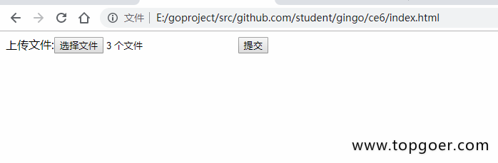

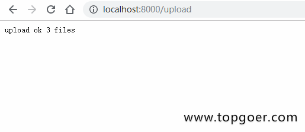

### routes group

- routes group是为了管理一些相同的URL

```go
package main

import (
   "github.com/gin-gonic/gin"
   "fmt"
)

// gin的helloWorld

func main() {
   // 1.创建路由
   // 默认使用了2个中间件Logger(), Recovery()
   r := gin.Default()
   // 路由组1 ，处理GET请求
   v1 := r.Group("/v1")
   // {} 是书写规范
   {
      v1.GET("/login", login)
      v1.GET("submit", submit)
   }
   v2 := r.Group("/v2")
   {
      v2.POST("/login", login)
      v2.POST("/submit", submit)
   }
   r.Run(":8000")
}

func login(c *gin.Context) {
   name := c.DefaultQuery("name", "jack")
   c.String(200, fmt.Sprintf("hello %s\n", name))
}

func submit(c *gin.Context) {
   name := c.DefaultQuery("name", "lily")
   c.String(200, fmt.Sprintf("hello %s\n", name))
}
```

效果演示:

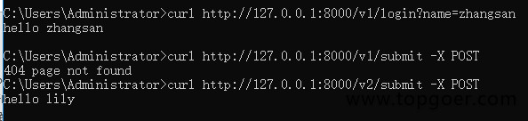

### gin框架实现404页面

```go
package main

import (
    "fmt"
    "net/http"

    "github.com/gin-gonic/gin"
)

func main() {
    r := gin.Default()
    r.GET("/user", func(c *gin.Context) {
        //指定默认值
        //http://localhost:8080/user 才会打印出来默认的值
        name := c.DefaultQuery("name", "枯藤")
        c.String(http.StatusOK, fmt.Sprintf("hello %s", name))2020-08-05 09:22:11 星期三
    })
    r.NoRoute(func(c *gin.Context) {
        c.String(http.StatusNotFound, "404 not found2222")
    })
    r.Run()
}
```

### 路由原理

- httprouter会将所有路由规则构造一颗前缀树
- 例如有 root and as at cn com

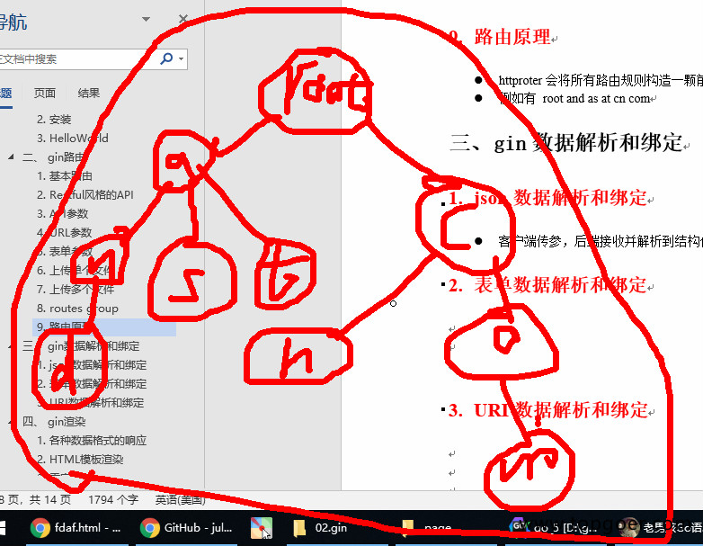

## gin数据解析和绑定

### Json 数据解析和绑定

- 客户端传参，后端接收并解析到结构体

```go
package main

import (
   "github.com/gin-gonic/gin"
   "net/http"
)

// 定义接收数据的结构体
type Login struct {
   // binding:"required"修饰的字段，若接收为空值，则报错，是必须字段
   User    string `form:"username" json:"user" uri:"user" xml:"user" binding:"required"`
   Pssword string `form:"password" json:"password" uri:"password" xml:"password" binding:"required"`
}

func main() {
   // 1.创建路由
   // 默认使用了2个中间件Logger(), Recovery()
   r := gin.Default()
   // JSON绑定
   r.POST("loginJSON", func(c *gin.Context) {
      // 声明接收的变量
      var json Login
      // 将request的body中的数据，自动按照json格式解析到结构体
      if err := c.ShouldBindJSON(&json); err != nil {
         // 返回错误信息
         // gin.H封装了生成json数据的工具
         c.JSON(http.StatusBadRequest, gin.H{"error": err.Error()})
         return
      }
      // 判断用户名密码是否正确
      if json.User != "root" || json.Pssword != "admin" {
         c.JSON(http.StatusBadRequest, gin.H{"status": "304"})
         return
      }
      c.JSON(http.StatusOK, gin.H{"status": "200"})
   })
   r.Run(":8000")
}
```

效果演示：

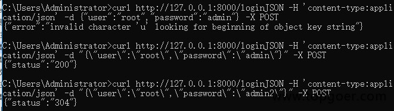

### 表单数据解析和绑定

```html
<!DOCTYPE html>
<html lang="en">
<head>
    <meta charset="UTF-8">
    <meta name="viewport" content="width=device-width, initial-scale=1.0">
    <meta http-equiv="X-UA-Compatible" content="ie=edge">
    <title>Document</title>
</head>
<body>
    <form action="http://localhost:8000/loginForm" method="post" enctype="application/x-www-form-urlencoded">
        用户名<input type="text" name="username"><br>
        密码<input type="password" name="password">
        <input type="submit" value="提交">
    </form>
</body>
</html>
package main

import (
    "net/http"

    "github.com/gin-gonic/gin"
)

// 定义接收数据的结构体
type Login struct {
    // binding:"required"修饰的字段，若接收为空值，则报错，是必须字段
    User    string `form:"username" json:"user" uri:"user" xml:"user" binding:"required"`
    Pssword string `form:"password" json:"password" uri:"password" xml:"password" binding:"required"`
}

func main() {
    // 1.创建路由
    // 默认使用了2个中间件Logger(), Recovery()
    r := gin.Default()
    // JSON绑定
    r.POST("/loginForm", func(c *gin.Context) {
        // 声明接收的变量
        var form Login
        // Bind()默认解析并绑定form格式
        // 根据请求头中content-type自动推断
        if err := c.Bind(&form); err != nil {
            c.JSON(http.StatusBadRequest, gin.H{"error": err.Error()})
            return
        }
        // 判断用户名密码是否正确
        if form.User != "root" || form.Pssword != "admin" {
            c.JSON(http.StatusBadRequest, gin.H{"status": "304"})
            return
        }
        c.JSON(http.StatusOK, gin.H{"status": "200"})
    })
    r.Run(":8000")
}
```

效果展示：

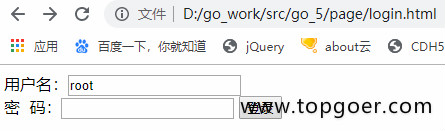

### URI数据解析和绑定

```go
package main

import (
    "net/http"

    "github.com/gin-gonic/gin"
)

// 定义接收数据的结构体
type Login struct {
    // binding:"required"修饰的字段，若接收为空值，则报错，是必须字段
    User    string `form:"username" json:"user" uri:"user" xml:"user" binding:"required"`
    Pssword string `form:"password" json:"password" uri:"password" xml:"password" binding:"required"`
}

func main() {
    // 1.创建路由
    // 默认使用了2个中间件Logger(), Recovery()
    r := gin.Default()
    // JSON绑定
    r.GET("/:user/:password", func(c *gin.Context) {
        // 声明接收的变量
        var login Login
        // Bind()默认解析并绑定form格式
        // 根据请求头中content-type自动推断
        if err := c.ShouldBindUri(&login); err != nil {
            c.JSON(http.StatusBadRequest, gin.H{"error": err.Error()})
            return
        }
        // 判断用户名密码是否正确
        if login.User != "root" || login.Pssword != "admin" {
            c.JSON(http.StatusBadRequest, gin.H{"status": "304"})
            return
        }
        c.JSON(http.StatusOK, gin.H{"status": "200"})
    })
    r.Run(":8000")
}
```

效果演示：

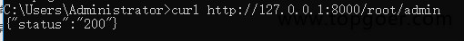

## gin渲染

### 各种数据格式的响应

- json、结构体、XML、YAML类似于java的properties、ProtoBuf

```go
package main

import (
    "github.com/gin-gonic/gin"
    "github.com/gin-gonic/gin/testdata/protoexample"
)

// 多种响应方式
func main() {
    // 1.创建路由
    // 默认使用了2个中间件Logger(), Recovery()
    r := gin.Default()
    // 1.json
    r.GET("/someJSON", func(c *gin.Context) {
        c.JSON(200, gin.H{"message": "someJSON", "status": 200})
    })
    // 2. 结构体响应
    r.GET("/someStruct", func(c *gin.Context) {
        var msg struct {
            Name    string
            Message string
            Number  int
        }
        msg.Name = "root"
        msg.Message = "message"
        msg.Number = 123
        c.JSON(200, msg)
    })
    // 3.XML
    r.GET("/someXML", func(c *gin.Context) {
        c.XML(200, gin.H{"message": "abc"})
    })
    // 4.YAML响应
    r.GET("/someYAML", func(c *gin.Context) {
        c.YAML(200, gin.H{"name": "zhangsan"})
    })
    // 5.protobuf格式,谷歌开发的高效存储读取的工具
    // 数组？切片？如果自己构建一个传输格式，应该是什么格式？
    r.GET("/someProtoBuf", func(c *gin.Context) {
        reps := []int64{int64(1), int64(2)}
        // 定义数据
        label := "label"
        // 传protobuf格式数据
        data := &protoexample.Test{
            Label: &label,
            Reps:  reps,
        }
        c.ProtoBuf(200, data)
    })

    r.Run(":8000")
}
```

### HTML模板渲染

- gin支持加载HTML模板, 然后根据模板参数进行配置并返回相应的数据，本质上就是字符串替换
- LoadHTMLGlob()方法可以加载模板文件

```go
package main

import (
    "net/http"

    "github.com/gin-gonic/gin"
)

func main() {
    r := gin.Default()
    r.LoadHTMLGlob("tem/*")
    r.GET("/index", func(c *gin.Context) {
        c.HTML(http.StatusOK, "index.html", gin.H{"title": "我是测试", "ce": "123456"})
    })
    r.Run()
}
<!DOCTYPE html>
<html lang="en">
<head>
    <meta charset="UTF-8">
    <meta name="viewport" content="width=device-width, initial-scale=1.0">
    <meta http-equiv="X-UA-Compatible" content="ie=edge">
    <title>{{.title}}</title>
</head>
    <body>
        fgkjdskjdsh{{.ce}}
    </body>
</html>
```

目录结构:

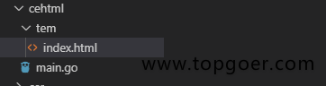

- 如果你的目录结构是下面的情况

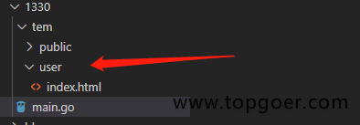

代码如下：

```go
package main

import (
    "net/http"

    "github.com/gin-gonic/gin"
)

func main() {
    r := gin.Default()
    r.LoadHTMLGlob("tem/**/*")
    r.GET("/index", func(c *gin.Context) {
        c.HTML(http.StatusOK, "user/index.html", gin.H{"title": "我是测试", "address": "www.5lmh.com"})
    })
    r.Run()
}
{{ define "user/index.html" }}
<!DOCTYPE html>
<html lang="en">
<head>
    <meta charset="UTF-8">
    <meta name="viewport" content="width=device-width, initial-scale=1.0">
    <meta http-equiv="X-UA-Compatible" content="ie=edge">
    <title>{{.title}}</title>
</head>
    <body>
        fgkjdskjdsh{{.address}}
    </body>
</html>
{{ end }}
```

- 如果你想进行头尾分离就是下面这种写法了：

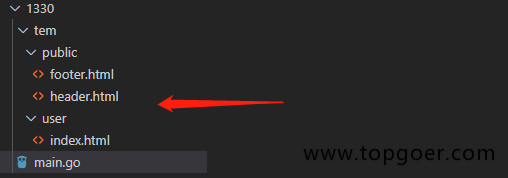

```go
package main

import (
    "net/http"

    "github.com/gin-gonic/gin"
)

func main() {
    r := gin.Default()
    r.LoadHTMLGlob("tem/**/*")
    r.GET("/index", func(c *gin.Context) {
        c.HTML(http.StatusOK, "user/index.html", gin.H{"title": "我是测试", "address": "www.5lmh.com"})
    })
    r.Run()
}
```

`user/index.html`文件代码：

```html
{{ define "user/index.html" }}
{{template "public/header" .}}
        fgkjdskjdsh{{.address}}
{{template "public/footer" .}}
{{ end }}
```

`public/header.html`文件代码：

```html
{{define "public/header"}}
<!DOCTYPE html>
<html lang="en">
<head>
    <meta charset="UTF-8">
    <meta name="viewport" content="width=device-width, initial-scale=1.0">
    <meta http-equiv="X-UA-Compatible" content="ie=edge">
    <title>{{.title}}</title>
</head>
    <body>

{{end}}
```

`public/footer.html`文件代码：

```html
{{define "public/footer"}}
</body>
</html>
{{ end }}
```

- 如果你需要引入静态文件需要定义一个静态文件目录

```
    r.Static("/assets", "./assets")
```

### 重定向

```go
package main

import (
    "net/http"

    "github.com/gin-gonic/gin"
)

func main() {
    r := gin.Default()
    r.GET("/index", func(c *gin.Context) {
        c.Redirect(http.StatusMovedPermanently, "http://www.5lmh.com")
    })
    r.Run()
}
```

### 同步异步

- goroutine机制可以方便地实现异步处理
- 另外，在启动新的goroutine时，不应该使用原始上下文，必须使用它的只读副本

```go
package main

import (
    "log"
    "time"

    "github.com/gin-gonic/gin"
)

func main() {
    // 1.创建路由
    // 默认使用了2个中间件Logger(), Recovery()
    r := gin.Default()
    // 1.异步
    r.GET("/long_async", func(c *gin.Context) {
        // 需要搞一个副本
        copyContext := c.Copy()
        // 异步处理
        go func() {
            time.Sleep(3 * time.Second)
            log.Println("异步执行：" + copyContext.Request.URL.Path)
        }()
    })
    // 2.同步
    r.GET("/long_sync", func(c *gin.Context) {
        time.Sleep(3 * time.Second)
        log.Println("同步执行：" + c.Request.URL.Path)
    })

    r.Run(":8000")
}
```

## gin中间件

### 全局中间件

- 所有请求都经过此中间件

```go
package main

import (
    "fmt"
    "time"

    "github.com/gin-gonic/gin"
)

// 定义中间
func MiddleWare() gin.HandlerFunc {
    return func(c *gin.Context) {
        t := time.Now()
        fmt.Println("中间件开始执行了")
        // 设置变量到Context的key中，可以通过Get()取
        c.Set("request", "中间件")
        status := c.Writer.Status()
        fmt.Println("中间件执行完毕", status)
        t2 := time.Since(t)
        fmt.Println("time:", t2)
    }
}

func main() {
    // 1.创建路由
    // 默认使用了2个中间件Logger(), Recovery()
    r := gin.Default()
    // 注册中间件
    r.Use(MiddleWare())
    // {}为了代码规范
    {
        r.GET("/ce", func(c *gin.Context) {
            // 取值
            req, _ := c.Get("request")
            fmt.Println("request:", req)
            // 页面接收
            c.JSON(200, gin.H{"request": req})
        })

    }
    r.Run()
}
```

输出结果：

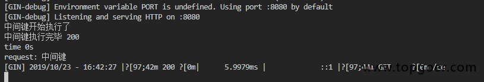


注意:
请注意黑色的数据里面有一步算时间差没有执行(需要学习Next就懂了)

### Next()方法

```go
package main

import (
    "fmt"
    "time"

    "github.com/gin-gonic/gin"
)

// 定义中间
func MiddleWare() gin.HandlerFunc {
    return func(c *gin.Context) {
        t := time.Now()
        fmt.Println("中间件开始执行了")
        // 设置变量到Context的key中，可以通过Get()取
        c.Set("request", "中间件")
        // 执行函数
        c.Next()
        // 中间件执行完后续的一些事情
        status := c.Writer.Status()
        fmt.Println("中间件执行完毕", status)
        t2 := time.Since(t)
        fmt.Println("time:", t2)
    }
}

func main() {
    // 1.创建路由
    // 默认使用了2个中间件Logger(), Recovery()
    r := gin.Default()
    // 注册中间件
    r.Use(MiddleWare())
    // {}为了代码规范
    {
        r.GET("/ce", func(c *gin.Context) {
            // 取值
            req, _ := c.Get("request")
            fmt.Println("request:", req)
            // 页面接收
            c.JSON(200, gin.H{"request": req})
        })

    }
    r.Run()
}
```

输出结果：

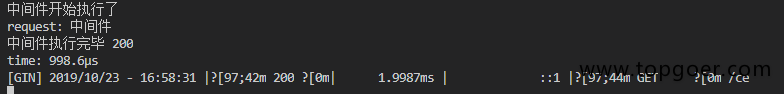

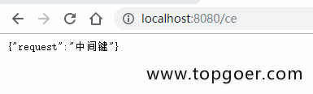

### 局部中间件

```go
package main

import (
    "fmt"
    "time"

    "github.com/gin-gonic/gin"
)

// 定义中间
func MiddleWare() gin.HandlerFunc {
    return func(c *gin.Context) {
        t := time.Now()
        fmt.Println("中间件开始执行了")
        // 设置变量到Context的key中，可以通过Get()取
        c.Set("request", "中间件")
        // 执行函数
        c.Next()
        // 中间件执行完后续的一些事情
        status := c.Writer.Status()
        fmt.Println("中间件执行完毕", status)
        t2 := time.Since(t)
        fmt.Println("time:", t2)
    }
}

func main() {
    // 1.创建路由
    // 默认使用了2个中间件Logger(), Recovery()
    r := gin.Default()
    //局部中间键使用
    r.GET("/ce", MiddleWare(), func(c *gin.Context) {
        // 取值
        req, _ := c.Get("request")
        fmt.Println("request:", req)
        // 页面接收
        c.JSON(200, gin.H{"request": req})
    })
    r.Run()
}
```

效果演示：


### 中间件练习

- 定义程序计时中间件，然后定义2个路由，执行函数后应该打印统计的执行时间，如下：

```go
package main

import (
    "fmt"
    "time"

    "github.com/gin-gonic/gin"
)

// 定义中间
func myTime(c *gin.Context) {
    start := time.Now()
    c.Next()
    // 统计时间
    since := time.Since(start)
    fmt.Println("程序用时：", since)
}

func main() {
    // 1.创建路由
    // 默认使用了2个中间件Logger(), Recovery()
    r := gin.Default()
    // 注册中间件
    r.Use(myTime)
    // {}为了代码规范
    shoppingGroup := r.Group("/shopping")
    {
        shoppingGroup.GET("/index", shopIndexHandler)
        shoppingGroup.GET("/home", shopHomeHandler)
    }
    r.Run(":8000")
}

func shopIndexHandler(c *gin.Context) {
    time.Sleep(5 * time.Second)
}

func shopHomeHandler(c *gin.Context) {
    time.Sleep(3 * time.Second)
}
```

效果演示：

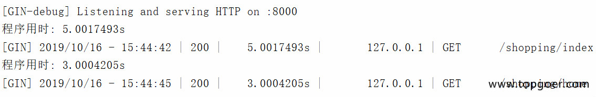

### 列表

**谷歌翻译欢迎查看原文 https://github.com/gin-gonic/contrib/blob/master/README.md**

- [RestGate](https://github.com/pjebs/restgate) - REST API端点的安全身份验证
- [staticbin](https://github.com/olebedev/staticbin) - 用于从二进制数据提供静态文件的中间件/处理程序
- [gin-cors](https://github.com/gin-contrib/cors) - CORS杜松子酒的官方中间件
- [gin-csrf](https://github.com/utrack/gin-csrf) - CSRF保护
- [gin-health](https://github.com/utrack/gin-health) - 通过[gocraft/health](https://github.com/gocraft/health)报告的中间件
- [gin-merry](https://github.com/utrack/gin-merry) - 带有上下文的漂亮 [打印](https://github.com/ansel1/merry) 错误的中间件
- [gin-revision](https://github.com/appleboy/gin-revision-middleware) - 用于Gin框架的修订中间件
- [gin-jwt](https://github.com/appleboy/gin-jwt) - 用于Gin框架的JWT中间件
- [gin-sessions](https://github.com/kimiazhu/ginweb-contrib/tree/master/sessions) - 基于mongodb和mysql的会话中间件
- [gin-location](https://github.com/drone/gin-location) - 用于公开服务器的主机名和方案的中间件
- [gin-nice-recovery](https://github.com/ekyoung/gin-nice-recovery) - 紧急恢复中间件，可让您构建更好的用户体验
- [gin-limit](https://github.com/aviddiviner/gin-limit) - 限制同时请求；可以帮助增加交通流量
- [gin-limit-by-key](https://github.com/yangxikun/gin-limit-by-key) - 一种内存中的中间件，用于通过自定义键和速率限制访问速率。
- [ez-gin-template](https://github.com/michelloworld/ez-gin-template) - gin简单模板包装
- [gin-hydra](https://github.com/janekolszak/gin-hydra) - gin中间件[Hydra](https://github.com/ory-am/hydra)
- [gin-glog](https://github.com/zalando/gin-glog) - 旨在替代Gin的默认日志
- [gin-gomonitor](https://github.com/zalando/gin-gomonitor) - 用于通过Go-Monitor公开指标
- [gin-oauth2](https://github.com/zalando/gin-oauth2) - 用于OAuth2
- [static](https://github.com/hyperboloide/static) gin框架的替代静态资产处理程序。
- [xss-mw](https://github.com/dvwright/xss-mw) - XssMw是一种中间件，旨在从用户提交的输入中“自动删除XSS”
- [gin-helmet](https://github.com/danielkov/gin-helmet) - 简单的安全中间件集合。
- [gin-jwt-session](https://github.com/ScottHuangZL/gin-jwt-session) - 提供JWT / Session / Flash的中间件，易于使用，同时还提供必要的调整选项。也提供样品。
- [gin-template](https://github.com/foolin/gin-template) - 用于gin框架的html / template易于使用。
- [gin-redis-ip-limiter](https://github.com/Salvatore-Giordano/gin-redis-ip-limiter) - 基于IP地址的请求限制器。它可以与redis和滑动窗口机制一起使用。
- [gin-method-override](https://github.com/bu/gin-method-override) - _method受Ruby的同名机架启发而被POST形式参数覆盖的方法
- [gin-access-limit](https://github.com/bu/gin-access-limit) - limit-通过指定允许的源CIDR表示法的访问控制中间件。
- [gin-session](https://github.com/go-session/gin-session) - 用于Gin的Session中间件
- [gin-stats](https://github.com/semihalev/gin-stats) - 轻量级和有用的请求指标中间件
- [gin-statsd](https://github.com/amalfra/gin-statsd) - 向statsd守护进程报告的Gin中间件
- [gin-health-check](https://github.com/RaMin0/gin-health-check) - check-用于Gin的健康检查中间件
- [gin-session-middleware](https://github.com/go-session/gin-session) - 一个有效，安全且易于使用的Go Session库。
- [ginception](https://github.com/kubastick/ginception) - 漂亮的例外页面
- [gin-inspector](https://github.com/fatihkahveci/gin-inspector) - 用于调查http请求的Gin中间件。
- [gin-dump](https://github.com/tpkeeper/gin-dump) - Gin中间件/处理程序，用于转储请求和响应的标头/正文。对调试应用程序非常有帮助。
- [go-gin-prometheus](https://github.com/zsais/go-gin-prometheus) - Gin Prometheus metrics exporter
- [ginprom](https://github.com/chenjiandongx/ginprom) - Gin的Prometheus指标导出器
- [gin-go-metrics](https://github.com/bmc-toolbox/gin-go-metrics) - Gin middleware to gather and store metrics using [rcrowley/go-metrics](https://github.com/rcrowley/go-metrics)
- [ginrpc](https://github.com/xxjwxc/ginrpc) - Gin 中间件/处理器自动绑定工具。通过像beego这样的注释路线来支持对象注册

## 会话控制

### Cookie介绍

- HTTP是无状态协议，服务器不能记录浏览器的访问状态，也就是说服务器不能区分两次请求是否由同一个客户端发出
- Cookie就是解决HTTP协议无状态的方案之一，中文是小甜饼的意思
- Cookie实际上就是服务器保存在浏览器上的一段信息。浏览器有了Cookie之后，每次向服务器发送请求时都会同时将该信息发送给服务器，服务器收到请求后，就可以根据该信息处理请求
- Cookie由服务器创建，并发送给浏览器，最终由浏览器保存

**Cookie的用途**

- 测试服务端发送cookie给客户端，客户端请求时携带cookie

### Cookie的使用

- 测试服务端发送cookie给客户端，客户端请求时携带cookie

```go
package main

import (
   "github.com/gin-gonic/gin"
   "fmt"
)

func main() {
   // 1.创建路由
   // 默认使用了2个中间件Logger(), Recovery()
   r := gin.Default()
   // 服务端要给客户端cookie
   r.GET("cookie", func(c *gin.Context) {
      // 获取客户端是否携带cookie
      cookie, err := c.Cookie("key_cookie")
      if err != nil {
         cookie = "NotSet"
         // 给客户端设置cookie
         //  maxAge int, 单位为秒
         // path,cookie所在目录
         // domain string,域名
         //   secure 是否智能通过https访问
         // httpOnly bool  是否允许别人通过js获取自己的cookie
         c.SetCookie("key_cookie", "value_cookie", 60, "/",
            "localhost", false, true)
      }
      fmt.Printf("cookie的值是： %s\n", cookie)
   })
   r.Run(":8000")
}
```

### Cookie练习

- 模拟实现权限验证中间件
  - 有2个路由，login和home
  - login用于设置cookie
  - home是访问查看信息的请求
  - 在请求home之前，先跑中间件代码，检验是否存在cookie
- 访问home，会显示错误，因为权限校验未通过

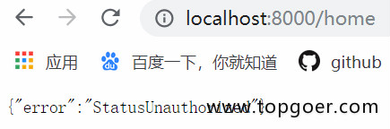

- 然后访问登录的请求，登录并设置cookie

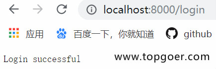

- 再次访问home，访问成功

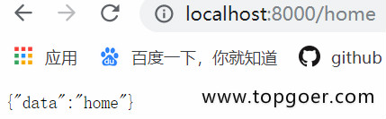

```go
package main

import (
   "github.com/gin-gonic/gin"
   "net/http"
)

func AuthMiddleWare() gin.HandlerFunc {
   return func(c *gin.Context) {
      // 获取客户端cookie并校验
      if cookie, err := c.Cookie("abc"); err == nil {
         if cookie == "123" {
            c.Next()
            return
         }
      }
      // 返回错误
      c.JSON(http.StatusUnauthorized, gin.H{"error": "err"})
      // 若验证不通过，不再调用后续的函数处理
      c.Abort()
      return
   }
}

func main() {
   // 1.创建路由
   r := gin.Default()
   r.GET("/login", func(c *gin.Context) {
      // 设置cookie
      c.SetCookie("abc", "123", 60, "/",
         "localhost", false, true)
      // 返回信息
      c.String(200, "Login success!")
   })
   r.GET("/home", AuthMiddleWare(), func(c *gin.Context) {
      c.JSON(200, gin.H{"data": "home"})
   })
   r.Run(":8000")
}
```

访问 /home 和 /login进行测试

### Cookie的缺点

- 不安全，明文
- 增加带宽消耗
- 可以被禁用
- cookie有上限

### Sessions

gorilla/sessions为自定义session后端提供cookie和文件系统session以及基础结构。

主要功能是：

- 简单的API：将其用作设置签名（以及可选的加密）cookie的简便方法。
- 内置的后端可将session存储在cookie或文件系统中。
- Flash消息：一直持续读取的session值。
- 切换session持久性（又称“记住我”）和设置其他属性的便捷方法。
- 旋转身份验证和加密密钥的机制。
- 每个请求有多个session，即使使用不同的后端也是如此。
- 自定义session后端的接口和基础结构：可以使用通用API检索并批量保存来自不同商店的session。

代码：

```go
package main

import (
    "fmt"
    "net/http"

    "github.com/gorilla/sessions"
)

// 初始化一个cookie存储对象
// something-very-secret应该是一个你自己的密匙，只要不被别人知道就行
var store = sessions.NewCookieStore([]byte("something-very-secret"))

func main() {
    http.HandleFunc("/save", SaveSession)
    http.HandleFunc("/get", GetSession)
    err := http.ListenAndServe(":8080", nil)
    if err != nil {
        fmt.Println("HTTP server failed,err:", err)
        return
    }
}

func SaveSession(w http.ResponseWriter, r *http.Request) {
    // Get a session. We're ignoring the error resulted from decoding an
    // existing session: Get() always returns a session, even if empty.

    //　获取一个session对象，session-name是session的名字
    session, err := store.Get(r, "session-name")
    if err != nil {
        http.Error(w, err.Error(), http.StatusInternalServerError)
        return
    }

    // 在session中存储值
    session.Values["foo"] = "bar"
    session.Values[42] = 43
    // 保存更改
    session.Save(r, w)
}
func GetSession(w http.ResponseWriter, r *http.Request) {
    session, err := store.Get(r, "session-name")
    if err != nil {
        http.Error(w, err.Error(), http.StatusInternalServerError)
        return
    }
    foo := session.Values["foo"]
    fmt.Println(foo)
}
```

删除session的值：

```
    // 删除
    // 将session的最大存储时间设置为小于零的数即为删除
    session.Options.MaxAge = -1
    session.Save(r, w)
```

官网地址：http://www.gorillatoolkit.org/pkg/sessions

## 参数验证

### 结构体验证

用gin框架的数据验证，可以不用解析数据，减少if else，会简洁许多。

```go
package main

import (
    "fmt"
    "time"

    "github.com/gin-gonic/gin"
)

//Person ..
type Person struct {
    //不能为空并且大于10
    Age      int       `form:"age" binding:"required,gt=10"`
    Name     string    `form:"name" binding:"required"`
    Birthday time.Time `form:"birthday" time_format:"2006-01-02" time_utc:"1"`
}

func main() {
    r := gin.Default()
    r.GET("/5lmh", func(c *gin.Context) {
        var person Person
        if err := c.ShouldBind(&person); err != nil {
            c.String(500, fmt.Sprint(err))
            return
        }
        c.String(200, fmt.Sprintf("%#v", person))
    })
    r.Run()
}
```

演示地址：

http://localhost:8080/5lmh?age=11&name=枯藤&birthday=2006-01-02

### 自定义验证

都在代码里自己看吧

```go
package main

import (
    "fmt"
    "net/http"

    "github.com/gin-gonic/gin"
    "gopkg.in/go-playground/validator.v9"
)

/*
    对绑定解析到结构体上的参数，自定义验证功能
    比如我们需要对URL的接受参数进行判断，判断用户名是否为root如果是root通过否则返回false
*/
type Login struct {
    User    string `uri:"user" validate:"checkName"`
    Pssword string `uri:"password"`
}

// 自定义验证函数
func checkName(fl validator.FieldLevel) bool {
    if fl.Field().String() != "root" {
        return false
    }
    return true
}
func main() {
    r := gin.Default()
    validate := validator.New()
    r.GET("/:user/:password", func(c *gin.Context) {
        var login Login
         //注册自定义函数，与struct tag关联起来
        err := validate.RegisterValidation("checkName", checkName)
        if err := c.ShouldBindUri(&login); err != nil {
            c.JSON(http.StatusBadRequest, gin.H{"error": err.Error()})
            return
        }
        err = validate.Struct(login)
        if err != nil {
            for _, err := range err.(validator.ValidationErrors) {
                fmt.Println(err)
            }
            return
        }
        fmt.Println("success")
    })
    r.Run()
}
```

示例2：

```go
package main

import (
    "net/http"
    "reflect"
    "time"

    "github.com/gin-gonic/gin"
    "github.com/gin-gonic/gin/binding"
    "gopkg.in/go-playground/validator.v8"
)

// Booking contains binded and validated data.
type Booking struct {
    //定义一个预约的时间大于今天的时间
    CheckIn time.Time `form:"check_in" binding:"required,bookabledate" time_format:"2006-01-02"`
    //gtfield=CheckIn退出的时间大于预约的时间
    CheckOut time.Time `form:"check_out" binding:"required,gtfield=CheckIn" time_format:"2006-01-02"`
}

func bookableDate(
    v *validator.Validate, topStruct reflect.Value, currentStructOrField reflect.Value,
    field reflect.Value, fieldType reflect.Type, fieldKind reflect.Kind, param string,
) bool {
    //field.Interface().(time.Time)获取参数值并且转换为时间格式
    if date, ok := field.Interface().(time.Time); ok {
        today := time.Now()
        if today.Unix() > date.Unix() {
            return false
        }
    }
    return true
}

func main() {
    route := gin.Default()
    //注册验证
    if v, ok := binding.Validator.Engine().(*validator.Validate); ok {
        //绑定第一个参数是验证的函数第二个参数是自定义的验证函数
        v.RegisterValidation("bookabledate", bookableDate)
    }

    route.GET("/5lmh", getBookable)
    route.Run()
}

func getBookable(c *gin.Context) {
    var b Booking
    if err := c.ShouldBindWith(&b, binding.Query); err == nil {
        c.JSON(http.StatusOK, gin.H{"message": "Booking dates are valid!"})
    } else {
        c.JSON(http.StatusBadRequest, gin.H{"error": err.Error()})
    }
}

// curl -X GET "http://localhost:8080/5lmh?check_in=2019-11-07&check_out=2019-11-20"
// curl -X GET "http://localhost:8080/5lmh?check_in=2019-09-07&check_out=2019-11-20"
// curl -X GET "http://localhost:8080/5lmh?check_in=2019-11-07&check_out=2019-11-01"
```

## Validator 

### 介绍

Validator 是基于 tag（标记）实现结构体和单个字段的值验证库，它包含以下功能：

- 使用验证 tag（标记）或自定义验证器进行跨字段和跨结构体验证。
- 关于 slice、数组和 map，允许验证多维字段的任何或所有级别。
- 能够深入 map 键和值进行验证。
- 通过在验证之前确定接口的基础类型来处理类型接口。
- 处理自定义字段类型（如 sql 驱动程序 Valuer）。
- 别名验证标记，它允许将多个验证映射到单个标记，以便更轻松地定义结构体上的验证。
- 提取自定义的字段名称，例如，可以指定在验证时提取 JSON 名称，并在生成的 FieldError 中使用该名称。
- 可自定义 i18n 错误消息。
- Web 框架 gin 的默认验证器。

### 安装：

使用 go get：

```go
go get github.com/go-playground/validator/v10
```

然后将 Validator 包导入到代码中：

```go
import "github.com/go-playground/validator/v10"
```

### 变量验证

Var 方法使用 tag（标记）验证方式验证单个变量。

```go
func (*validator.Validate).Var(field interface{}, tag string) error
```

它接收一个 interface{} 空接口类型的 field 和一个 string 类型的 tag，返回传递的非法值得无效验证错误，否则将 nil 或 ValidationErrors 作为错误。如果错误不是 nil，则需要断言错误去访问错误数组，例如：

```go
validationErrors := err.(validator.ValidationErrors)
```

如果是验证数组、slice 和 map，可能会包含多个错误。

示例代码：

```go
func main() {
  validate := validator.New()
  // 验证变量
  email := "admin#admin.com"
  email := ""
  err := validate.Var(email, "required,email")
  if err != nil {
    validationErrors := err.(validator.ValidationErrors)
    fmt.Println(validationErrors)
    // output: Key: '' Error:Field validation for '' failed on the 'email' tag
    // output: Key: '' Error:Field validation for '' failed on the 'required' tag
    return
  }
}
```

### 结构体验证

结构体验证结构体公开的字段，并自动验证嵌套结构体，除非另有说明。

```go
func (*validator.Validate).Struct(s interface{}) error
```

它接收一个 interface{} 空接口类型的 s，返回传递的非法值得无效验证错误，否则将 nil 或 ValidationErrors 作为错误。如果错误不是 nil，则需要断言错误去访问错误数组，例如：

```go
validationErrors := err.(validator.ValidationErrors)
```

实际上，Struct 方法是调用的 StructCtx 方法，因为本文不是源码讲解，所以此处不展开赘述，如有兴趣，可以查看源码。

示例代码：

```go
func main() {
  validate = validator.New()
  type User struct {
    ID     int64  `json:"id" validate:"gt=0"`
    Name   string `json:"name" validate:"required"`
    Gender string `json:"gender" validate:"required,oneof=man woman"`
    Age    uint8  `json:"age" validate:"required,gte=0,lte=130"`
    Email  string `json:"email" validate:"required,email"`
  }
  user := &User{
    ID:     1,
    Name:   "frank",
    Gender: "boy",
    Age:    180,
    Email:  "gopher@88.com",
  }
  err = validate.Struct(user)
  if err != nil {
    validationErrors := err.(validator.ValidationErrors)
    // output: Key: 'User.Age' Error:Field validation for 'Age' failed on the 'lte' tag
    // fmt.Println(validationErrors)
    fmt.Println(validationErrors.Translate(trans))
    return
  }
}
```

细心的读者可能已经发现，错误输出信息并不友好，错误输出信息中的字段不仅没有使用备用名（首字母小写的字段名），也没有翻译为中文。通过改动代码，使错误输出信息变得友好。

注册一个函数，获取结构体字段的备用名称：

```go
validate.RegisterTagNameFunc(func(fld reflect.StructField) string {
    name := strings.SplitN(fld.Tag.Get("json"), ",", 2)[0]
    if name == "-" {
      return "j"
    }
    return name
  })
```

错误信息翻译为中文：

```go
zh := zh.New()
uni = ut.New(zh)
trans, _ := uni.GetTranslator("zh")
_ = zh_translations.RegisterDefaultTranslations(validate, trans)
```

### 标签

通过以上章节的内容，读者应该已经了解到 Validator 是一个基于 tag（标签），实现结构体和单个字段的值验证库。

本章节列举一些比较常用的标签：

| 标签      | 描述     |
| :-------- | :------- |
| eq        | 等于     |
| gt        | 大于     |
| gte       | 大于等于 |
| lt        | 小于     |
| lte       | 小于等于 |
| ne        | 不等于   |
| max       | 最大值   |
| min       | 最小值   |
| oneof     | 其中一个 |
| required  | 必需的   |
| unique    | 唯一的   |
| isDefault | 默认值   |
| len       | 长度     |
| email     | 邮箱格式 |

转自： Golang语言开发栈

## 多语言翻译验证

当业务系统对验证信息有特殊需求时，例如：返回信息需要自定义，手机端返回的信息需要是中文而pc端发挥返回的信息需要时英文，如何做到请求一个接口满足上述三种情况。

```go
package main

import (
    "fmt"

    "github.com/gin-gonic/gin"
    "github.com/go-playground/locales/en"
    "github.com/go-playground/locales/zh"
    "github.com/go-playground/locales/zh_Hant_TW"
    ut "github.com/go-playground/universal-translator"
    "gopkg.in/go-playground/validator.v9"
    en_translations "gopkg.in/go-playground/validator.v9/translations/en"
    zh_translations "gopkg.in/go-playground/validator.v9/translations/zh"
    zh_tw_translations "gopkg.in/go-playground/validator.v9/translations/zh_tw"
)

var (
    Uni      *ut.UniversalTranslator
    Validate *validator.Validate
)

type User struct {
    Username string `form:"user_name" validate:"required"`
    Tagline  string `form:"tag_line" validate:"required,lt=10"`
    Tagline2 string `form:"tag_line2" validate:"required,gt=1"`
}

func main() {
    en := en.New()
    zh := zh.New()
    zh_tw := zh_Hant_TW.New()
    Uni = ut.New(en, zh, zh_tw)
    Validate = validator.New()

    route := gin.Default()
    route.GET("/5lmh", startPage)
    route.POST("/5lmh", startPage)
    route.Run(":8080")
}

func startPage(c *gin.Context) {
    //这部分应放到中间件中
    locale := c.DefaultQuery("locale", "zh")
    trans, _ := Uni.GetTranslator(locale)
    switch locale {
    case "zh":
        zh_translations.RegisterDefaultTranslations(Validate, trans)
        break
    case "en":
        en_translations.RegisterDefaultTranslations(Validate, trans)
        break
    case "zh_tw":
        zh_tw_translations.RegisterDefaultTranslations(Validate, trans)
        break
    default:
        zh_translations.RegisterDefaultTranslations(Validate, trans)
        break
    }

    //自定义错误内容
    Validate.RegisterTranslation("required", trans, func(ut ut.Translator) error {
        return ut.Add("required", "{0} must have a value!", true) // see universal-translator for details
    }, func(ut ut.Translator, fe validator.FieldError) string {
        t, _ := ut.T("required", fe.Field())
        return t
    })

    //这块应该放到公共验证方法中
    user := User{}
    c.ShouldBind(&user)
    fmt.Println(user)
    err := Validate.Struct(user)
    if err != nil {
        errs := err.(validator.ValidationErrors)
        sliceErrs := []string{}
        for _, e := range errs {
            sliceErrs = append(sliceErrs, e.Translate(trans))
        }
        c.String(200, fmt.Sprintf("%#v", sliceErrs))
    }
    c.String(200, fmt.Sprintf("%#v", "user"))
}
```

正确的链接：http://localhost:8080/testing?user_name=枯藤&tag_line=9&tag_line2=33&locale=zh

http://localhost:8080/testing?user_name=枯藤&tag_line=9&tag_line2=3&locale=en 返回英文的验证信息

http://localhost:8080/testing?user_name=枯藤&tag_line=9&tag_line2=3&locale=zh 返回中文的验证信息

查看更多的功能可以查看官网 gopkg.in/go-playground/validator.v9

## 其他

### 日志文件

```go
package main

import (
    "io"
    "os"

    "github.com/gin-gonic/gin"
)

func main() {
    gin.DisableConsoleColor()

    // Logging to a file.
    f, _ := os.Create("gin.log")
    gin.DefaultWriter = io.MultiWriter(f)

    // 如果需要同时将日志写入文件和控制台，请使用以下代码。
    // gin.DefaultWriter = io.MultiWriter(f, os.Stdout)
    r := gin.Default()
    r.GET("/ping", func(c *gin.Context) {
        c.String(200, "pong")
    })
    r.Run()
}
```

效果演示：

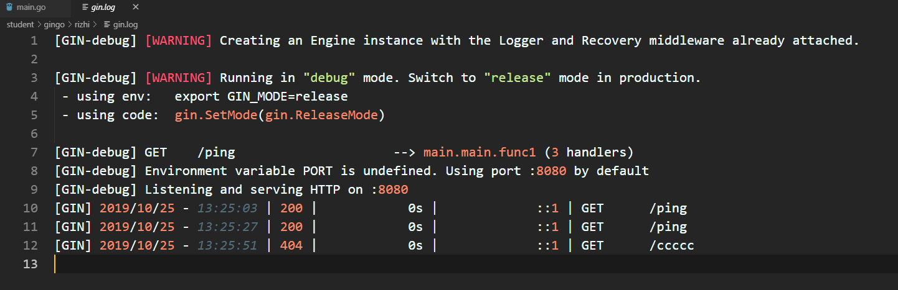

### Air实时加载

本章我们要介绍一个神器——Air能够实时监听项目的代码文件，在代码发生变更之后自动重新编译并执行，大大提高gin框架项目的开发效率。

**为什么需要实时加载？**

之前使用Python编写Web项目的时候，常见的Flask或Django框架都是支持实时加载的，你修改了项目代码之后，程序能够自动重新加载并执行（live-reload），这在日常的开发阶段是十分方便的。

在使用Go语言的gin框架在本地做开发调试的时候，经常需要在变更代码之后频繁的按下Ctrl+C停止程序并重新编译再执行，这样就不是很方便。

**Air介绍**

怎样才能在基于gin框架开发时实现实时加载功能呢？像这种烦恼肯定不会只是你一个人的烦恼，所以我报着肯定有现成轮子的心态开始了全网大搜索。果不其然就在Github上找到了一个工具：Air[1]。它支持以下特性：

- 彩色日志输出
- 自定义构建或二进制命令
- 支持忽略子目录
- 启动后支持监听新目录
- 更好的构建过程

**安装Air**

**Go**

这也是最经典的安装方式：

```
    go get -u github.com/cosmtrek/air
```

**MacOS**

```
    curl -fLo air https://git.io/darwin_air
```

**Linux**

```
    curl -fLo air https://git.io/linux_air
```

**Windows**

```
    curl -fLo air.exe https://git.io/windows_air
```

**Dcoker**

```
docker run -it --rm \
    -w "<PROJECT>" \
    -e "air_wd=<PROJECT>" \
    -v $(pwd):<PROJECT> \
    -p <PORT>:<APP SERVER PORT> \
    cosmtrek/air
    -c <CONF>
```

然后按照下面的方式在docker中运行你的项目：

```
docker run -it --rm \
    -w "/go/src/github.com/cosmtrek/hub" \
    -v $(pwd):/go/src/github.com/cosmtrek/hub \
    -p 9090:9090 \
    cosmtrek/air
```

**使用Air**

为了敲命令更简单更方便，你应该把`alias air='~/.air'`加到你的`.bashrc`或`.zshrc`中。

首先进入你的项目目录：

```
    cd /path/to/your_project
```

最简单的用法就是直接执行下面的命令：

```
# 首先在当前目录下查找 `.air.conf`配置文件，如果找不到就使用默认的
air -c .air.conf
```

推荐的使用方法是：

```
# 1. 在当前目录创建一个新的配置文件.air.conf
touch .air.conf

# 2. 复制 `air.conf.example` 中的内容到这个文件，然后根据你的需要去修改它

# 3. 使用你的配置运行 air, 如果文件名是 `.air.conf`，只需要执行 `air`。
air
```

**air_example.conf示例**

完整的air_example.conf示例配置如下，可以根据自己的需要修改。

```
# [Air](https://github.com/cosmtrek/air) TOML 格式的配置文件

# 工作目录
# 使用 . 或绝对路径，请注意 `tmp_dir` 目录必须在 `root` 目录下
root = "."
tmp_dir = "tmp"

[build]
# 只需要写你平常编译使用的shell命令。你也可以使用 `make`
cmd = "go build -o ./tmp/main ."
# 由`cmd`命令得到的二进制文件名
bin = "tmp/main"
# 自定义的二进制，可以添加额外的编译标识例如添加 GIN_MODE=release
full_bin = "APP_ENV=dev APP_USER=air ./tmp/main"
# 监听以下文件扩展名的文件.
include_ext = ["go", "tpl", "tmpl", "html"]
# 忽略这些文件扩展名或目录
exclude_dir = ["assets", "tmp", "vendor", "frontend/node_modules"]
# 监听以下指定目录的文件
include_dir = []
# 排除以下文件
exclude_file = []
# 如果文件更改过于频繁，则没有必要在每次更改时都触发构建。可以设置触发构建的延迟时间
delay = 1000 # ms
# 发生构建错误时，停止运行旧的二进制文件。
stop_on_error = true
# air的日志文件名，该日志文件放置在你的`tmp_dir`中
log = "air_errors.log"

[log]
# 显示日志时间
time = true

[color]
# 自定义每个部分显示的颜色。如果找不到颜色，使用原始的应用程序日志。
main = "magenta"
watcher = "cyan"
build = "yellow"
runner = "green"

[misc]
# 退出时删除tmp目录
clean_on_exit = true
```

本文转自：https://mp.weixin.qq.com/s/QgL3jx8Au7YbRjlfsIFgJg

### gin与net/http的关系

**gin 概览**

想弄清楚 gin, 需要弄明白以下几个问题:

- request数据是如何流转的
- gin框架到底扮演了什么角色
- 请求从gin流入net/http, 最后又是如何回到gin中
- gin的context为何能承担起来复杂的需求
- gin的路由算法
- gin的中间件是什么
- gin的Engine具体是个什么东西
- net/http的requeset, response都提供了哪些有用的东西

从gin的官方第一个demo入手.

```
package main

import "github.com/gin-gonic/gin"

func main() {
    r := gin.Default()
    r.GET("/ping", func(c *gin.Context) {
        c.JSON(200, gin.H{
          "message": "pong",
        })
    })
    r.Run() // listen and serve on 0.0.0.0:8080
}
```

r.Run() 的源码:

```
func (engine *Engine) Run(addr ...string) (err error) {
    defer func() { debugPrintError(err) }()

    address := resolveAddress(addr)
    debugPrint("Listening and serving HTTP on %s\n", address)
    err = http.ListenAndServe(address, engine)
    return
}
```

看到开始调用的是 http.ListenAndServe(address, engine), 这个函数是net/http的函数， 然后请求数据就在net/http开始流转.

**Request 数据是如何流转的**

先不使用gin, 直接使用net/http来处理http请求

```
func main() {
    http.HandleFunc("/", func(w http.ResponseWriter, r *http.Request) {
        w.Write([]byte("Hello World"))
    })

    if err := http.ListenAndServe(":8000", nil); err != nil {
        fmt.Println("start http server fail:", err)
    }
}
```

在浏览器中输入localhost:8000, 会看到Hello World. 下面利用这个简单demo看下request的流转流程.

**HTTP是如何建立起来的**

简单的说一下http请求是如何建立起来的(需要有基本的网络基础, 可以找相关的书籍查看, 推荐看UNIX网络编程卷1：套接字联网API)

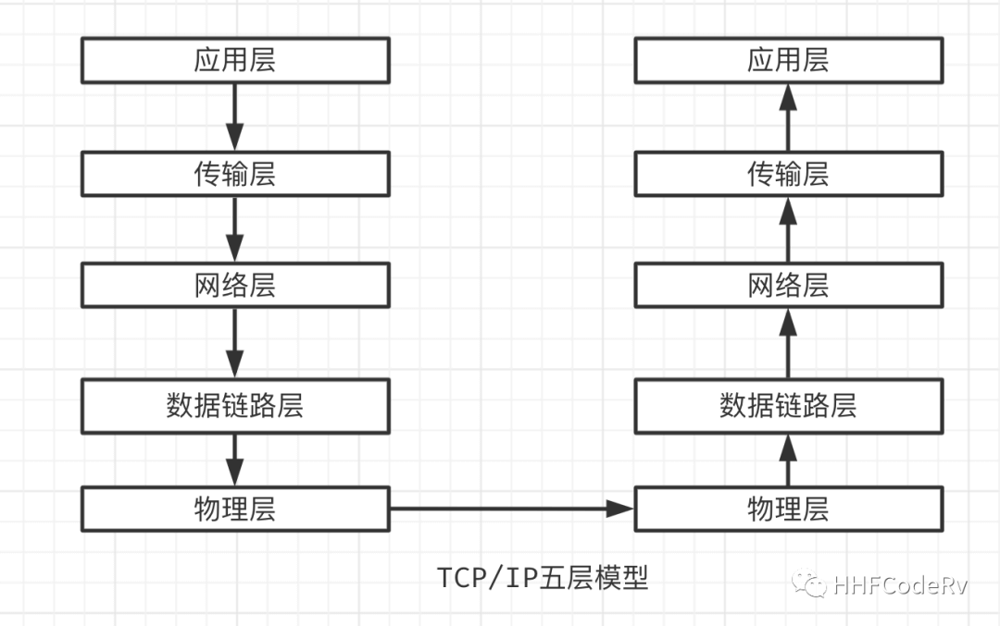
TCP/IP 五层模型

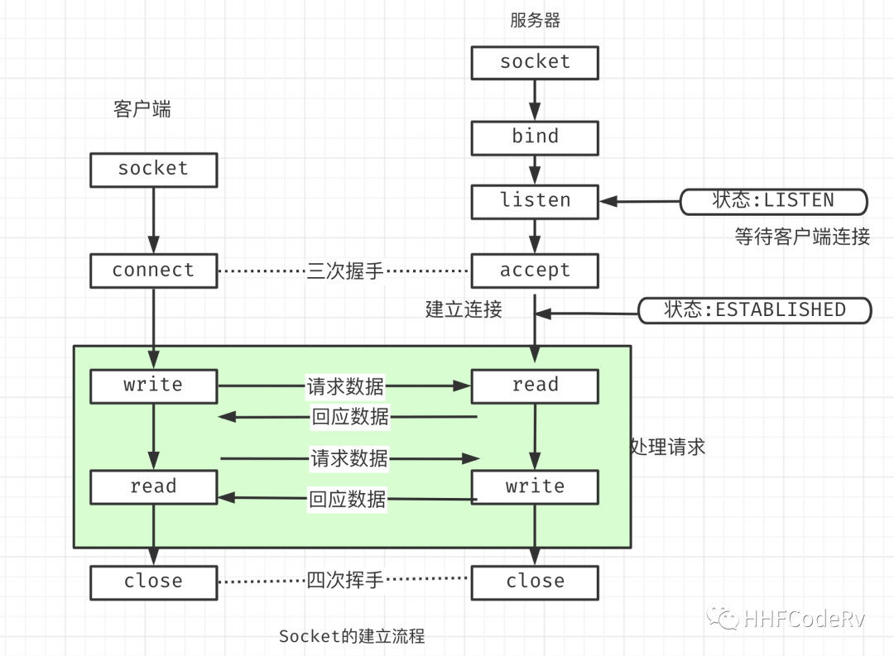
socket建立过程

在TCP/IP五层模型下, HTTP位于应用层, 需要有传输层来承载HTTP协议. 传输层比较常见的协议是TCP,UDP, SCTP等. 由于UDP不可靠, SCTP有自己特殊的运用场景, 所以一般情况下HTTP是由TCP协议承载的(可以使用wireshark抓包然后查看各层协议)

使用TCP协议的话, 就会涉及到TCP是如何建立起来的. 面试中能够常遇到的名词三次握手, 四次挥手就是在这里产生的. 具体的建立流程就不在陈述了, 大概流程就是图中左半边

所以说, 要想能够对客户端http请求进行回应的话, 就首先需要建立起来TCP连接, 也就是socket. 下面要看下net/http是如何建立起来socket?

**net/http 是如何建立 socket 的**

从图上可以看出, 不管server代码如何封装, 都离不开bind,listen,accept这些函数. 就从上面这个简单的demo入手查看源码.

```
func main() {
    http.HandleFunc("/", func(w http.ResponseWriter, r *http.Request) {
        w.Write([]byte("Hello World"))
    })

    if err := http.ListenAndServe(":8000", nil); err != nil {
        fmt.Println("start http server fail:", err)
    }
}
```

**注册路由**

```
http.HandleFunc("/", func(w http.ResponseWriter, r *http.Request) {
    w.Write([]byte("Hello World"))
})
```

这段代码是在注册一个路由及这个路由的handler到DefaultServeMux中

```
// server.go:L2366-2388
func (mux *ServeMux) Handle(pattern string, handler Handler) {
    mux.mu.Lock()
    defer mux.mu.Unlock()

    if pattern == "" {
        panic("http: invalid pattern")
    }
    if handler == nil {
        panic("http: nil handler")
    }
    if _, exist := mux.m[pattern]; exist {
        panic("http: multiple registrations for " + pattern)
    }

    if mux.m == nil {
        mux.m = make(map[string]muxEntry)
    }
    mux.m[pattern] = muxEntry{h: handler, pattern: pattern}

    if pattern[0] != '/' {
        mux.hosts = true
    }
}
```

可以看到这个路由注册太过简单了, 也就给gin, iris, echo等框架留下了扩展的空间, 后面详细说这个东西

**服务监听及响应**

上面路由已经注册到net/http了, 下面就该如何建立socket了, 以及最后又如何取到已经注册到的路由, 将正确的响应信息从handler中取出来返回给客户端

**1.创建 socket**

```
if err := http.ListenAndServe(":8000", nil); err != nil {
    fmt.Println("start http server fail:", err)
}
// net/http/server.go:L3002-3005
func ListenAndServe(addr string, handler Handler) error {
    server := &Server{Addr: addr, Handler: handler}
    return server.ListenAndServe()
}
// net/http/server.go:L2752-2765
func (srv *Server) ListenAndServe() error {
    // ... 省略代码
    ln, err := net.Listen("tcp", addr) // <-----看这里listen
    if err != nil {
      return err
    }
    return srv.Serve(tcpKeepAliveListener{ln.(*net.TCPListener)})
}
```

**2.Accept 等待客户端链接**

```
// net/http/server.go:L2805-2853
func (srv *Server) Serve(l net.Listener) error {
    // ... 省略代码
    for {
      rw, e := l.Accept() // <----- 看这里accept
      if e != nil {
        select {
        case <-srv.getDoneChan():
          return ErrServerClosed
        default:
        }
        if ne, ok := e.(net.Error); ok && ne.Temporary() {
          if tempDelay == 0 {
            tempDelay = 5 * time.Millisecond
          } else {
            tempDelay *= 2
          }
          if max := 1 * time.Second; tempDelay > max {
            tempDelay = max
          }
          srv.logf("http: Accept error: %v; retrying in %v", e, tempDelay)
          time.Sleep(tempDelay)
          continue
        }
        return e
      }
      tempDelay = 0
      c := srv.newConn(rw)
      c.setState(c.rwc, StateNew) // before Serve can return
      go c.serve(ctx) // <--- 看这里
    }
}
```

**3. 提供回调接口 ServeHTTP**

```
// net/http/server.go:L1739-1878
func (c *conn) serve(ctx context.Context) {
    // ... 省略代码
    serverHandler{c.server}.ServeHTTP(w, w.req)
    w.cancelCtx()
    if c.hijacked() {
      return
    }
    w.finishRequest()
    // ... 省略代码
}
// net/http/server.go:L2733-2742
func (sh serverHandler) ServeHTTP(rw ResponseWriter, req *Request) {
    handler := sh.srv.Handler
    if handler == nil {
      handler = DefaultServeMux
    }
    if req.RequestURI == "*" && req.Method == "OPTIONS" {
      handler = globalOptionsHandler{}
    }
    handler.ServeHTTP(rw, req)
}
// net/http/server.go:L2352-2362
func (mux *ServeMux) ServeHTTP(w ResponseWriter, r *Request) {
    if r.RequestURI == "*" {
      if r.ProtoAtLeast(1, 1) {
        w.Header().Set("Connection", "close")
      }
      w.WriteHeader(StatusBadRequest)
      return
    }
    h, _ := mux.Handler(r) // <--- 看这里
    h.ServeHTTP(w, r)
}
```

**4. 回调到实际要执行的 ServeHTTP**

```
// net/http/server.go:L1963-1965
func (f HandlerFunc) ServeHTTP(w ResponseWriter, r *Request) {
   f(w, r)
}
```

这基本是整个过程的代码了.

1. ln, err := net.Listen(“tcp”, addr)做了初试化了socket, bind, listen的操作.
2. rw, e := l.Accept()进行accept, 等待客户端进行连接
3. go c.serve(ctx) 启动新的goroutine来处理本次请求. 同时主goroutine继续等待客户端连接, 进行高并发操作
4. h, _ := mux.Handler(r) 获取注册的路由, 然后拿到这个路由的handler, 然后将处理结果返回给客户端

从这里也能够看出来, net/http基本上提供了全套的服务.

**为什么会出现很多go框架**

```
// net/http/server.go:L2218-2238
func (mux *ServeMux) match(path string) (h Handler, pattern string) {
    // Check for exact match first.
    v, ok := mux.m[path]
    if ok {
        return v.h, v.pattern
    }

    // Check for longest valid match.
    var n = 0
    for k, v := range mux.m {
      if !pathMatch(k, path) {
          continue
      }
      if h == nil || len(k) > n {
          n = len(k)
          h = v.h
          pattern = v.pattern
      }
    }
    return
}
```

从这段函数可以看出来, 匹配规则过于简单, 当能匹配到路由的时候就返回其对应的handler, 当不能匹配到时就返回/. net/http的路由匹配根本就不符合 RESTful 的规则，遇到稍微复杂一点的需求时，这个简单的路由匹配规则简直就是噩梦。

所以基本所有的go框架干的最主要的一件事情就是重写net/http的route。我们直接说 gin就是一个 httprouter 也不过分, 当然gin也提供了其他比较主要的功能, 后面会一一介绍。

综述, net/http基本已经提供http服务的70%的功能, 那些号称贼快的go框架, 基本上都是提供一些功能, 让我们能够更好的处理客户端发来的请求. 如果你有兴趣的话，也可以基于 net/http 做一个 Go 框架出来。

### http请求是如何流入gin的

本篇文章是 gin 源码分析系列的第二篇，这篇文章我们主要弄清一个问题：一个请求通过 net/http 的 socket 接收到请求后, 是如何回到 gin 中处理逻辑的？

我们仍然以 net/http 的例子开始

```
func main() {
    http.HandleFunc("/", func(w http.ResponseWriter, r *http.Request) {
        w.Write([]byte("Hello World"))
    })

    if err := http.ListenAndServe(":8000", nil); err != nil {
        fmt.Println("start http server fail:", err)
    }
}
```

这个例子中 http.HandleFunc 通过看源码，可以看到 URI “/“ 被注册到了 DefaultServeMux 上。

```
func HandleFunc(pattern string, handler func(ResponseWriter, *Request)) {
   DefaultServeMux.HandleFunc(pattern, handler)
}
```

**net/http ServeHTTP 的作用**

net/http 里面有个非常重要的 Handler interface。只有实现了这个方法才能请求的处理逻辑引入自己的处理流程中。

```
// https://github.com/golang/go/blob/master/src/net/http/server.go#L86-L88
type Handler interface {
   ServeHTTP(ResponseWriter, *Request)
}
```

默认的 DefaultServeMux 就实现了这个 ServeHTTP

这个 request 的流转过程：

1. socket.accept 接收到客户端请求后，启动 go c.serve(connCtx) [net/http server.go:L3013]行，专门处理这次请求，server 继续等待客户端连接
2. 获取能处理这次请求的 handler -> serverHandler{c.server}.ServeHTTP(w, w.req) [net/http server.go:L1952]
3. 跳转到真正的 ServeHTTP 去匹配路由，获取 handler
4. 由于并没有自定义路由，于是使用的是 net/http 默认路由 [net/http server.go:L2880-2887]
5. 所以最终调用去 DefaultServeMux 匹配路由，输出返回对应的结果

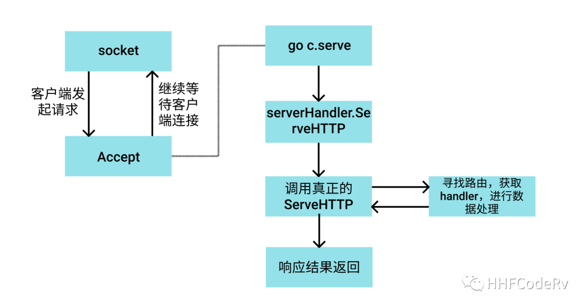

**探究 gin ServeHTTP 的调用链路**

下面是 gin 的官方 demo, 仅仅几行代码，就启动了一个 echo server。

```
package main

import "github.com/gin-gonic/gin"

func main() {
    r := gin.Default()
    r.GET("/ping", func(c *gin.Context) {
        c.JSON(200, gin.H{
            "message": "pong",
        })
    })
    r.Run() // listen and serve on 0.0.0.0:8080
}
```

这段代码的大概流程:

1. r := gin.Default() 初始化了相关的参数
2. 将路由 /ping 以及对应的 handler 注册到路由树中
3. 使用 r.Run() 启动 server

r.Run 的底层依然是 http.ListenAndServe

```
func (engine *Engine) Run(addr ...string) (err error) {
    defer func() { debugPrintError(err) }()

    trustedCIDRs, err := engine.prepareTrustedCIDRs()
    if err != nil {
        return err
    }
    engine.trustedCIDRs = trustedCIDRs
    address := resolveAddress(addr)
    debugPrint("Listening and serving HTTP on %s\n", address)
    err = http.ListenAndServe(address, engine)
    return
}
```

所以 gin 建立 socket 的过程，accept 客户端请求的过程与 net/http 没有差别，会同样重复上面的过程。唯一有差别的位置就是在于获取 ServeHTTP 的位置

```
func (sh serverHandler) ServeHTTP(rw ResponseWriter, req *Request) {
    handler := sh.srv.Handler
    if handler == nil {
        handler = DefaultServeMux
    }
    if req.RequestURI == "*" && req.Method == "OPTIONS" {
        handler = globalOptionsHandler{}
    }
    handler.ServeHTTP(rw, req)
}
```

由于 sh.srv.Handler 是 interface 类型，但是其真正的类型是 gin.Engine，根据 interace 的动态转发特性，最终会跳转到 gin.Engine.ServeHTTP 函数中。

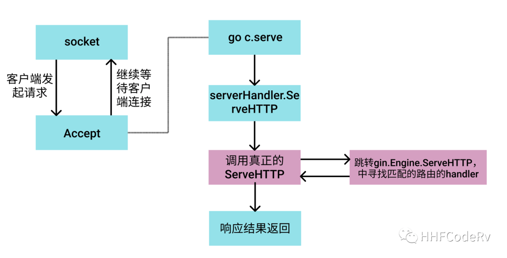

**gin.ServeHTTP 的实现**

```
func (engine *Engine) ServeHTTP(w http.ResponseWriter, req *http.Request) {
    c := engine.pool.Get().(*Context)
    c.writermem.reset(w)
    c.Request = req
    c.reset()

    engine.handleHTTPRequest(c)

    engine.pool.Put(c)
}
```

至此，终于我们看到了 gin.ServeHTTP 的全貌了

1. 从 sync.pool 里面拿去一块内存
2. 对这块内存做初始化工作，防止数据污染
3. 处理请求 handleHTTPRequest
4. 请求处理完成后，把这块内存归还到 sync.pool 中

现在看起来这个实现很简单，其实不然，这才是 gin 能够处理数据的第一步，也仅仅将请求流转入 gin 的处理流程而已。

这里做个结论：通过上面的源码流程分析，我们知道 net/http.ServeHTTP 这个函数相当重要性, 主要有这个函数的存在, 才能将请求流转入目前 Go 的这些框架里面，同学们有兴趣的话，可以去看看 echo, iris, go-zero 等框架是如何实现 ServeHTTP 的。

### gin 路由的实现剖析

gin 原理剖析说到这里，就完全进入 gin 的逻辑里面了。gin 已经拿到 http 请求了，第一件重要的事情肯定就是重写路由了，所以本节内容主要是分析 gin 的路由相关的内容。

其实 gin 的路由也不是完全自己写的，其实很重要的一部分代码是使用的开源的 julienschmidt/httprouter，当然 gin 也添加了部分自己独有的功能，如：routergroup。

**什么是路由？**

这个其实挺容易理解的，就是根据不同的 URL 找到对应的处理函数即可。

目前业界 Server 端 API 接口的设计方式一般是遵循 RESTful 风格的规范。当然我也见过某些大公司为了降低开发人员的心智负担和学习成本，接口完全不区分 GET/POST/DELETE 请求，完全靠接口的命名来表示。

举个简单的例子，如：”删除用户”

```
RESTful:    DELETE  /user/hhf
No RESTful: GET     /deleteUser?name=hhf
```

这种 No RESTful 的方式，有的时候确实减少一些沟通问题和学习成本，但是只能内部使用了。这种不区分 GET/POST 的 Web 框架一般设计的会比较灵活，但是开发人员水平参差不齐，会导致出现很多“接口毒瘤”，等你发现的时候已经无可奈何了，如下面这些接口：

```
GET /selectUserList?userIds=[1,2,3] -> 参数是否可以是数组？
GET /getStudentlist?skuIdCntMap={"200207366":1} -> 参数是否可以是字典？
```

这样的接口设计会导致开源的框架都是解析不了的，只能自己手动一层一层 decode 字符串，这里就不再详细铺开介绍了，等下一节说到 gin Bind 系列函数时再详细说一下。

继续回到上面 RESTful 风格的接口上面来，拿下面这些简单的请求来说：

```
GET    /user/{userID} HTTP/1.1
POST   /user/{userID} HTTP/1.1
PUT    /user/{userID} HTTP/1.1
DELETE /user/{userID} HTTP/1.1
```

这是比较规范的 RESTful API设计，分别代表：

- 获取 userID 的用户信息
- 更新 userID 的用户信息（当然还有其 json body，没有写出来）
- 创建 userID 的用户（当然还有其 json body，没有写出来）
- 删除 userID 的用户

可以看到同样的 URI，不同的请求 Method，最终其他代表的要处理的事情也完全不一样。

看到这里你可以思考一下，假如让你来设计这个路由，要满足上面的这些功能，你会如何设计呢？

**gin 路由设计**

**如何设计不同的 Method ?**

通过上面的介绍，已经知道 RESTful 是要区分方法的，不同的方法代表意义也完全不一样，gin 是如何实现这个的呢？

其实很简单，不同的方法就是一棵路由树，所以当 gin 注册路由的时候，会根据不同的 Method 分别注册不同的路由树。

```
GET    /user/{userID} HTTP/1.1
POST   /user/{userID} HTTP/1.1
PUT    /user/{userID} HTTP/1.1
DELETE /user/{userID} HTTP/1.1
```

如这四个请求，分别会注册四颗路由树出来。

```
func (engine *Engine) addRoute(method, path string, handlers HandlersChain) {
    //....
    root := engine.trees.get(method)
    if root == nil {
        root = new(node)
        root.fullPath = "/"
        engine.trees = append(engine.trees, methodTree{method: method, root: root})
    }
    root.addRoute(path, handlers)
    // ...
}
```

其实代码也很容易看懂，

- 拿到一个 method 方法时，去 trees slice 中遍历
- 如果 trees slice 存在这个 method, 则这个URL对应的 handler 直接添加到找到的路由树上
- 如果没有找到，则重新创建一颗新的方法树出来, 然后将 URL对应的 handler 添加到这个路由 树上

**gin 路由的注册过程**

```
func main() {
    r := gin.Default()
    r.GET("/ping", func(c *gin.Context) {
        c.JSON(200, gin.H{
            "message": "pong",
        })
    })
    r.Run() // listen and serve on 0.0.0.0:8080
}
```

这段简单的代码里，r.Get 就注册了一个路由 /ping 进入 GET tree 中。这是最普通的，也是最常用的注册方式。

不过上面这种写法，一般都是用来测试的，正常情况下我们会将 handler 拿到 Controller 层里面去，注册路由放在专门的 route 管理里面，这里就不再详细拓展，等后面具体说下 gin 的架构分层设计。

```
//controller/somePost.go
func SomePostFunc(ctx *gin.Context) {
    // do something
    context.String(http.StatusOK, "some post done")
}
​```go
// route.go
router.POST("/somePost", controller.SomePostFunc)
```

**使用 RouteGroup**

```
v1 := router.Group("v1")
{
    v1.POST("login", func(context *gin.Context) {
        context.String(http.StatusOK, "v1 login")
    })
}
```

RouteGroup 是非常重要的功能，举个例子：一个完整的 server 服务，url 需要分为鉴权接口和非鉴权接口，就可以使用 RouteGroup 来实现。其实最常用的，还是用来区分接口的版本升级。这些操作, 最终都会在反应到gin的路由树上

**gin 路由的具体实现**

```
func main() {
    r := gin.Default()
    r.GET("/ping", func(c *gin.Context) {
        c.JSON(200, gin.H{
            "message": "pong",
        })
    })
    r.Run() // listen and serve on 0.0.0.0:8080
}
```

还是从这个简单的例子入手。我们只需要弄清楚下面三个问题即可：

- URL->ping 放在哪里了？
- handler-> 放在哪里了？
- URL 和 handler 是如何关联起来的？

**1. GET/POST/DELETE/..的最终归宿**

```
func (group *RouterGroup) GET(relativePath string, handlers ...HandlerFunc) IRoutes {
   return group.handle(http.MethodGet, relativePath, handlers)
}
```

在调用POST, GET, HEAD等路由HTTP相关函数时, 会调用handle函数。handle 是 gin 路由的统一入口。

```
// routergroup.go:L72-77
func (group *RouterGroup) handle(httpMethod, relativePath string, handlers HandlersChain) IRoutes {
    absolutePath := group.calculateAbsolutePath(relativePath)
    handlers = group.combineHandlers(handlers)
    group.engine.addRoute(httpMethod, absolutePath, handlers)
    return group.returnObj()
}
```

**2. 生成路由树**

下面考虑一个情况，假设有下面这样的路由，你会怎么设计这棵路由树？

```
GET /abc 
GET /abd
GET /af
```

当然最简单最粗暴的就是每个字符串占用一个树的叶子节点，不过这种设计会带来的问题：占用内存会升高，我们看到 abc, abd, af 都是用共同的前缀的，如果能共用前缀的话，是可以省内存空间的。

gin 路由树是一棵前缀树. 我们前面说过 gin 的每种方法(POST, GET …)都有自己的一颗树，当然这个是根据你注册路由来的，并不是一上来把每种方式都注册一遍。gin 每棵路由大概是下面的样子

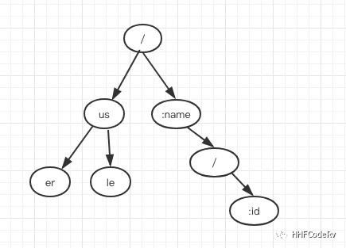

这个流程的代码太多，这里就不再贴出具体代码里，有兴趣的同学可以按照这个思路看下去即可。

**3. handler 与 URL 关联**

```
type node struct {
    path      string
    indices   string
    wildChild bool
    nType     nodeType
    priority  uint32
    children  []*node // child nodes, at most 1 :param style node at the end of the array
    handlers  HandlersChain
    fullPath  string
}
```

node 是路由树的整体结构

- children 就是一颗树的叶子结点。每个路由的去掉前缀后，都被分布在这些 children 数组里
- path 就是当前叶子节点的最长的前缀
- handlers 里面存放的就是当前叶子节点对应的路由的处理函数

**当收到客户端请求时，如何找到对应的路由的handler？**

《gin 源码阅读(2) - http请求是如何流入gin的?》第二篇说到 net/http 非常重要的函数 ServeHTTP，当 server 收到请求时，必然会走到这个函数里。由于 gin 实现这个 ServeHTTP，所以流量就转入 gin 的逻辑里面。

```
// gin.go:L439-443
func (engine *Engine) ServeHTTP(w http.ResponseWriter, req *http.Request) {
    c := engine.pool.Get().(*Context)
    c.writermem.reset(w)
    c.Request = req
    c.reset()

    engine.handleHTTPRequest(c)

    engine.pool.Put(c)
}
```

所以，当 gin 收到客户端的请求时, 第一件事就是去路由树里面去匹配对应的 URL，找到相关的路由, 拿到相关的处理函数。其实这个过程就是 handleHTTPRequest 要干的事情。

```
func (engine *Engine) handleHTTPRequest(c *Context) {
    // ...
    t := engine.trees
    for i, tl := 0, len(t); i < tl; i++ {
        if t[i].method != httpMethod {
            continue
        }
        root := t[i].root
        // Find route in tree
        value := root.getValue(rPath, c.params, unescape)
        if value.params != nil {
            c.Params = *value.params
        }
        if value.handlers != nil {
            c.handlers = value.handlers
            c.fullPath = value.fullPath
            c.Next()
            c.writermem.WriteHeaderNow()
            return
        }
        if httpMethod != "CONNECT" && rPath != "/" {
            if value.tsr && engine.RedirectTrailingSlash {
                redirectTrailingSlash(c)
                return
            }
            if engine.RedirectFixedPath && redirectFixedPath(c, root, engine.RedirectFixedPath) {
                return
            }
        }
      break
    }
  // ...
}
```

从代码上看这个过程其实也很简单：

- 遍历所有的路由树，找到对应的方法的那棵树
- 匹配对应的路由
- 找到对应的 handler

### 友好的请求参数处理

hi，大家好，我是 haohongfan。

通过 gin 的路由，已经把请求分配到具体的函数里面里面了，下面就要开始处理具体的业务逻辑了。

这里就进入 gin 封装的非常重要的的功能，对请求参数快速解析，让我们不纠结于参数的繁琐处理。当然这是对于比较标准的参数处理才可以，对于那些自定义的参数格式只能自己处理了。

**参数风格**

对于 RESTful 风格的 http 请求来说，参数的表现会有下面几种方式：

**URI 参数**

什么是 URI 参数？RESTful 风格的请求，某些请求的参数会通过 URI 来表现。

举个简单的例子：张三通过网上银行给李四转了 500 元，这个路由可以这么设计：

```
xxx.com/:name/transfer/:money/to/:name

非常具体的体现：
xxx.com/zhangsan/transfer/500/to/lisi
```

当然你会说这个路由设计会比较丑陋，不过在 URI 里面增加参数有的时候是比较方便的，gin 支持这种方式获取参数。

```
// This handler will match /user/john but will not match /user/ or /user
router.GET("/user/:name", uriFunc)
```

对于获取这种路由参数，gin 提供了两种方式去解析这种参数。

**方式1：Param**

```
func uriFunc(c *gin.Context) {
    name := c.Param("name")
    c.String(http.StatusOK, "Hello %s", name)
}
```

**方式2：bindUri**

```
type Person struct {
   Name string `uri:"name" binding:"required"`
}

func uriFunc(c *gin.Context) {
  var person Person
  if err := c.ShouldBindUri(&person); err != nil {
     c.JSON(400, gin.H{"msg": err.Error()})
     return
  }
  c.JSON(200, gin.H{"name": person.Name)
}
```

其实现原理很简单，就是在创建路由树的时候，将路由参数以及对应的值放入一个特定的 map 中即可。

```
func (ps Params) Get(name string) (string, bool) {
    for _, entry := range ps {
      if entry.Key == name {
        return entry.Value, true
      }
    }
    return "", false
}
```

**QueryString Parameter**

query String 即路由的 ? 之后的所带的参数，这种方式是比较常见的。

例如：/welcome?firstname=Jane&lastname=Doe

这里要注意的是，不管是 GET 还是 POST 都可以带 queryString Parameter。我曾经遇到某公司所有的参数都挂在 query string 上，这样做其实是不建议的，不过大家都这么做，只能顺其自然了。这么做的缺点很明显：

- 容易突破 URI 的长度限制，导致接口参数被截断。一般情况下服务器为了安全会对 URL 做长度限制，最大为2048
- 同时服务器也会对传输的大小也是有限制的，一般是 2k
- 当然这么做也是不安全的，都是明文的

这里就不具体罗列了，反正缺点挺多的。

这种参数也有两种获取方式：

**方式1：Query**

```
firstname := c.DefaultQuery("firstname", "Guest")
lastname := c.Query("lastname") // shortcut for c.Request.URL.Query().Get("lastname")
```

**方式2：Bind**

```
type Person struct {
   FirstName  string `form:"name"`
}

func queryFunc(c *gin.Context) {
    var person Person
    if c.ShouldBindQuery(&person) == nil {
        log.Println(person.Name)
    }
}
```

实现原理：其实很简单就是将请求参数解析出来而已，利用的 net/url 的相关函数。

```
//net/url.go:L1109
func (u *URL) Query() Values {
    v, _ := ParseQuery(u.RawQuery)
    return v
}
```

**Form**

Form 一般还是更多用在跟前端的混合开发的情况下。Form 可以用于所有的方法 POST,GET,HEAD,PATCH ……

这种参数也有两种获取方式：

**方式1：**

```
name := c.PostForm("name")
```

**方式2：**

```
type Person struct {
    Name string `form:"name"`
}

func formFunc(c *gin.Context) {
    var person Person
    if c.ShouldBind(&person) == nil {
        log.Println(person.Name)
    }
}
```

**Json Body**

Json Body 是被使用最多的方式，基本上各种语言库对 json 格式的解析非常完善了，而且还在不断的推陈出新。

gin 对 json 的解析只有一种方式。

```
type Person struct {
    Name string `json:"name"`
}

func jsonFunc(c *gin.Context) {
    var person Person
    if c.ShouldBind(&person) == nil {
        log.Println(person.Name)
    }
}
```

gin 默认是使用的 go 内置的 encoding/json 库，内置的 json 在 go 1.12 后性能得到了很大的提高。不过 Go 对接 PHP 的接口，如果用内置的 json 库简直就是一种折磨，gin 可以使用 jsoniter 来代替，只需要在编译的时候加上标志即可：”go build -tags=jsoniter .”，强烈建议对接 PHP 接口的同学，尝试 jsoniter 这个库，让你不再受 PHP 接口参数类型不确定之苦。

当然 gin 还支持其他类型参数的解析，如 Header，XML，YAML，Msgpack，Protobuf 等，这里就不再具体介绍了。

**Bind 系列函数的源码剖析**

使用 gin 解析 request 的参数，按照我的实践来看，使用 Bind 系列函数还是比较好一点，因为这样请求的参数会比较好归档、分类，也有助于后续的接口升级，而不是将接口的请求参数分散不同的 handler 里面。

**初始化 binding 相关对象**

gin 在程序启动就会默认初始化好 binding 相关的变量

```
// binding:L74
var (
 JSON          = jsonBinding{}
 XML           = xmlBinding{}
 Form          = formBinding{}
 Query         = queryBinding{}
 FormPost      = formPostBinding{}
 FormMultipart = formMultipartBinding{}
 ProtoBuf      = protobufBinding{}
 MsgPack       = msgpackBinding{}
 YAML          = yamlBinding{}
 Uri           = uriBinding{}
 Header        = headerBinding{}
)
```

**ShoudBind 与 MustBind 的区别**

bind 相关的系列函数大体上分为两类 ShoudBind 和 MustBind。实现上基本一样，为了有区别的 MustBind 在解析失败的时候，返回 HTTP 400 状态。

MustBindWith:

```
func (c *Context) MustBindWith(obj interface{}, b binding.Binding) error {
    if err := c.ShouldBindWith(obj, b); err != nil {
        c.AbortWithError(http.StatusBadRequest, err).SetType(ErrorTypeBind) // nolint: errcheck
        return err
    }
    return nil
}
```

ShoudBindWith:

```
func (c *Context) ShouldBindWith(obj interface{}, b binding.Binding) error {
   return b.Bind(c.Request, obj)
}
```

**匹配对应的参数 decoder**

不管是 MustBind 还是 ShouldBind，总体上解析又可以分为两类：一种是让 gin 自己判断使用哪种 decoder，另外一种就是指定某种 decoder。自己判断使用哪种 decoder 比 指定 decoder 多了一步判断，其他的都是一样的。

```
func (c *Context) ShouldBind(obj interface{}) error {
    b := binding.Default(c.Request.Method, c.ContentType())
    return c.ShouldBindWith(obj, b)
}

func Default(method, contentType string) Binding {
    if method == http.MethodGet {
        return Form
    }

    switch contentType {
    case MIMEJSON:
        return JSON
    case MIMEXML, MIMEXML2:
        return XML
    case MIMEPROTOBUF:
        return ProtoBuf
    case MIMEMSGPACK, MIMEMSGPACK2:
        return MsgPack
    case MIMEYAML:
        return YAML
    case MIMEMultipartPOSTForm:
        return FormMultipart
    default: // case MIMEPOSTForm:
        return Form
    }
}
```

ShouldBind/MustBind 会根据传入的 ContentType 来判断该使用哪种 decoder。不过对于 Header 和 Uri 方式的参数，只能用指定方式的decoder 了。

总结
本篇文章主要介绍了 gin 是如何快速处理客户端传递过的参数的。

### 灵活的返回值处理

hi，大家好，我是 haohongfan。

上一篇文章是关于如何快速解析客户端传递过来的参数的，参数解析出来后就开始了我们的业务的开发流程了。

业务处理的过程 gin 并没有给出对应的设计，这给业务开发带来了很多不方便的地方，很多公司会基于 gin 做二次开发，定制契合公司基础技术建设的框架升级，关于 gin 定制框架的内容这里不再详细展开，请关注后续文章。

经过业务逻辑框架的处理，已经有了对应的处理结果了，需要结果返回给客户端了，本篇文章主要介绍 gin 是如何处理响应结果的。

仍然以原生的 net/http 简单的例子开始我们的源码分析。

```
func main() {
    http.HandleFunc("/", func(w http.ResponseWriter, r *http.Request) {
        w.Write([]byte("Hello World"))
    })

    if err := http.ListenAndServe(":8000", nil); err != nil {
        fmt.Println("start http server fail:", err)
    }
}
```

output:

```
▶ curl -i -XGET 127.0.0.1:8000
HTTP/1.1 200 OK
Date: Sun, 10 Oct 2021 10:28:15 GMT
Content-Length: 11
Content-Type: text/plain; charset=utf-8

Hello World
```

可以看到调用 http.ResponseWriter.Write 即可将响应结果返回给客户端。不过也可以看出一些问题：

- 这个函数返回的值是默认的 text/plain 类型。如果想返回 application/json 就需要调用额外的设置 header 相关函数。
- 这个函数只能接受 []byte 类型变量。一般情况下，我们经过业务逻辑处理过的数据都是结构体类型的，要使用 Write，需要把结构体转换 []byte，这个就太不方便。
  类似 gin 提供的参数处理，gin 同样提供了很多格式的返回值，能让我们简化返回数据的处理。

下面是 gin 提供的 echo server，无需任何处理，就能返回一个 json 类型的返回值。

```
package main

import "github.com/gin-gonic/gin"

func main() {
    r := gin.Default()
    r.GET("/ping", func(c *gin.Context) {
        c.JSON(200, gin.H{
            "message": "pong",
        })
    })
    r.Run()
}
```

output:

```
▶ curl -i -XGET 127.0.0.1:8080/ping   
HTTP/1.1 200 OK
Content-Type: application/json; charset=utf-8
Date: Sun, 10 Oct 2021 05:40:21 GMT
Content-Length: 18

{"message":"pong"}
```

当然 gin 还提其他类型格式的返回值，如 xml, yaml, protobuf 等。

```
var (
 _ Render     = JSON{}
 _ Render     = IndentedJSON{}
 _ Render     = SecureJSON{}
 _ Render     = JsonpJSON{}
 _ Render     = XML{}
 _ Render     = String{}
 _ Render     = Redirect{}
 _ Render     = Data{}
 _ Render     = HTML{}
 _ HTMLRender = HTMLDebug{}
 _ HTMLRender = HTMLProduction{}
 _ Render     = YAML{}
 _ Render     = Reader{}
 _ Render     = AsciiJSON{}
 _ Render     = ProtoBuf{}
)
```

本文仅以比较常见的 json 类型格式的返回值阐述 gin 对 ResponseWriter 的实现原理。

**源码分析**

**1. 设置 json 的返回格式**

```
// gin/context.go:L956
func (c *Context) JSON(code int, obj interface{}) {
   c.Render(code, render.JSON{Data: obj})
}
```

初始化 render.JSON 类型变量

**2. 通过 interface 动态转发调用真正的 json 处理函数**

```
// gin/context.go:L904
func (c *Context) Render(code int, r render.Render) {
    c.Status(code)

    if !bodyAllowedForStatus(code) {
        r.WriteContentType(c.Writer)
        c.Writer.WriteHeaderNow()
        return
    }

    if err := r.Render(c.Writer); err != nil {
        panic(err)
    }
}
```

- 设置 Http status
- 处理 Http status 为 100 - 199、204、304 的情况
- 调用真正的 json 处理函数

**3. 组装 response 数据**

```
// gin/render/json.go:L67
func WriteJSON(w http.ResponseWriter, obj interface{}) error {
    writeContentType(w, jsonContentType)
    jsonBytes, err := json.Marshal(obj)
    if err != nil {
        return err
    }
    _, err = w.Write(jsonBytes)
    return err
}
```

设置 response Header 的 Content-Type 为 application/json; charset=utf-8
将要返回数据编码成 json 字符串
写入 gin.responseWriter

**4. 写入真正的 http.ResponseWriter**

```
// gin/response_writer.go:L76
func (w *responseWriter) Write(data []byte) (n int, err error) {
    w.WriteHeaderNow()
    n, err = w.ResponseWriter.Write(data)
    w.size += n
    return
}
```

这里 gin 实现了 ResponseWriter interface，对原生的 response 做了一定的扩展，不过最终依然是调用 net/http 的 response.Write 完成对请求数据的最终写入。

**总结**

本篇文章主要介绍了 gin 是如何完成对数据的组装然后返回给客户端的。写到这里基本上 gin 的整个流程就梳理完成了。gin 提供的功能就这么多，第一篇源码分析文章我提到 gin 是个 httprouter 基本就是这个原因。