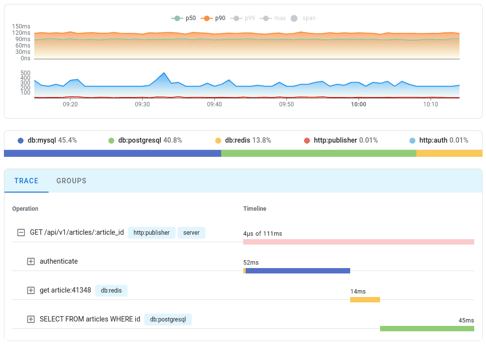

# Go Redis使用文档

## 入门

### 安装

go-redis 支持 2 个最新的 go 版本且依赖[Go modules在新窗口打开](https://github.com/golang/go/wiki/Modules)，如果 你还没有 go mod，你需要首先初始化:

```bash
go mod init github.com/my/repo
```

安装 go-redis/**v9** (支持所有的 redis 版本):

```bash
go get github.com/redis/go-redis/v9
```

### 连接到 Redis 服务器

连接到 Redis 服务器示例，更多配置参数，请参照 [redis.Options](https://redis.uptrace.dev/zh/guide/go-redis-option.html#redis-client):

```go
import "github.com/redis/go-redis/v9"

rdb := redis.NewClient(&redis.Options{
	Addr:	  "localhost:6379",
	Password: "", // 没有密码，默认值
	DB:		  0,  // 默认DB 0
})
```

同时也支持另外一种常见的连接字符串:

```go
opt, err := redis.ParseURL("redis://<user>:<pass>@localhost:6379/<db>")
if err != nil {
	panic(err)
}

rdb := redis.NewClient(opt)
```

#### 使用 TLS

你需要手动设置 `tls.Config`，你可以在 [这里在新窗口打开](https://pkg.go.dev/crypto/tls#example-LoadX509KeyPair) 了解相关 `tls.Config`更多的配置信息：

```go
rdb := redis.NewClient(&redis.Options{
	TLSConfig: &tls.Config{
		MinVersion: tls.VersionTLS12,
		ServerName: "you domain",
		//Certificates: []tls.Certificate{cert}
	},
})
```

如果你使用的是域名连接，且遇到了类似 `x509: cannot validate certificate for xxx.xxx.xxx.xxx because it doesn't contain any IP SANs`的错误 ，应该在 ServerName 中指定你的域名：[#1710在新窗口打开](https://github.com/redis/go-redis/discussions/1710)

```go
rdb := redis.NewClient(&redis.Options{
	TLSConfig: &tls.Config{
		MinVersion: tls.VersionTLS12,
		ServerName: "你的域名",
	},
})
```

#### SSH 方式

使用 SSH 协议连接:

```go
sshConfig := &ssh.ClientConfig{
	User:			 "root",
	Auth:			 []ssh.AuthMethod{ssh.Password("password")},
	HostKeyCallback: ssh.InsecureIgnoreHostKey(),
	Timeout:		 15 * time.Second,
}

sshClient, err := ssh.Dial("tcp", "remoteIP:22", sshConfig)
if err != nil {
	panic(err)
}

rdb := redis.NewClient(&redis.Options{
	Addr: net.JoinHostPort("127.0.0.1", "6379"),
	Dialer: func(ctx context.Context, network, addr string) (net.Conn, error) {
		return sshClient.Dial(network, addr)
	},
	// SSH不支持超时设置，在这里禁用
	ReadTimeout:  -1,
	WriteTimeout: -1,
})
```

#### dial tcp: i/o timeout

当你遇到 `dial tcp: i/o timeout` 错误时，表示 go-redis 无法连接 Redis 服务器，比如 redis 服务器没有 正常运行或监听了其他端口，以及可能被防火墙拦截等。你可以使用一些网络命令排查问题，例如 `telnet`:

```bash
telnet localhost 6379
Trying 127.0.0.1...
telnet: Unable to connect to remote host: Connection refused
```

如果你使用 Docker、Kubernetes、Istio、Service Mesh、Sidecar 方式运行，应该确保服务在容器完全可用后启 动，你可以通过[健康检查在新窗口打开](https://docs.docker.com/engine/reference/run/#healthcheck)、Readiness Gate、Istio `holdApplicationUntilProxyStarts`等。

### Context 上下文

go-redis 支持 Context，你可以使用它控制 [超时](https://redis.uptrace.dev/zh/guide/go-redis-debugging.html#timeouts) 或者传递一些数据, 也可以 [监控](https://redis.uptrace.dev/zh/guide/go-redis-monitoring.html) go-redis 性能。

```go
ctx := context.Background()
```

### 执行 Redis 命令

执行 Redis 命令:

```go
val, err := rdb.Get(ctx, "key").Result()
fmt.Println(val)
```

你也可以分别访问值和错误：

```go
get := rdb.Get(ctx, "key")
fmt.Println(get.Val(), get.Err())
```

### 执行尚不支持的命令

可以使用 `Do()` 方法执行尚不支持或者任意命令:

```go
val, err := rdb.Do(ctx, "get", "key").Result()
if err != nil {
	if err == redis.Nil {
		fmt.Println("key does not exists")
		return
	}
	panic(err)
}
fmt.Println(val.(string))
```

`Do()` 方法返回 [Cmd在新窗口打开](https://pkg.go.dev/github.com/redis/go-redis/v9#Cmd) 类型，你可以使用它获取你 想要的类型：

```go
// Text is a shortcut for get.Val().(string) with proper error handling.
val, err := rdb.Do(ctx, "get", "key").Text()
fmt.Println(val, err)
```

方法列表:

```go
s, err := cmd.Text()
flag, err := cmd.Bool()

num, err := cmd.Int()
num, err := cmd.Int64()
num, err := cmd.Uint64()
num, err := cmd.Float32()
num, err := cmd.Float64()

ss, err := cmd.StringSlice()
ns, err := cmd.Int64Slice()
ns, err := cmd.Uint64Slice()
fs, err := cmd.Float32Slice()
fs, err := cmd.Float64Slice()
bs, err := cmd.BoolSlice()
```

### redis.Nil

`redis.Nil` 是一种特殊的错误，严格意义上来说它并不是错误，而是代表一种状态，例如你使用 Get 命令获取 key 的值，当 key 不存在时，返回 `redis.Nil`。在其他比如 `BLPOP` 、 `ZSCORE` 也有类似的响应，你需要区 分错误：

```go
val, err := rdb.Get(ctx, "key").Result()
switch {
case err == redis.Nil:
	fmt.Println("key不存在")
case err != nil:
	fmt.Println("错误", err)
case val == "":
	fmt.Println("值是空字符串")
}
```

### Conn

redis.Conn 是从连接池中取出的单个连接，除非你有特殊的需要，否则尽量不要使用它。你可以使用它向 redis 发送任何数据并读取 redis 的响应，当你使用完毕时，应该把它返回给 go-redis，否则连接池会永远丢失一个连 接。

```go
cn := rdb.Conn(ctx)
defer cn.Close()

if err := cn.ClientSetName(ctx, "myclient").Err(); err != nil {
	panic(err)
}

name, err := cn.ClientGetName(ctx).Result()
if err != nil {
	panic(err)
}
fmt.Println("client name", name)
```

## Redis集群

go-redis 支持 [Redis Cluster](https://redis.io/topics/cluster-tutorial) 客户端， 如下面示例，`redis.ClusterClient` 表示集群对象，对集群内每个redis节点使用 `redis.Client` 对象进行通信，每个 `redis.Client` 会拥有单独的连接池。

连接到redis集群示例，更多配置参数，请参照 [redis.ClusterOptions](https://redis.uptrace.dev/zh/guide/go-redis-option.html#redis-cluster-client):

```go
import "github.com/redis/go-redis/v9"

rdb := redis.NewClusterClient(&redis.ClusterOptions{
    Addrs: []string{":7000", ":7001", ":7002", ":7003", ":7004", ":7005"},
})
```

遍历每个节点：

```go
err := rdb.ForEachShard(ctx, func(ctx context.Context, shard *redis.Client) error {
    return shard.Ping(ctx).Err()
})
if err != nil {
    panic(err)
}
```

只遍历主节点请使用： `ForEachMaster`， 只遍历从节点请使用： `ForEachSlave`

你也可以自定义的设置每个节点的初始化:

```go
rdb := redis.NewClusterClient(&redis.ClusterOptions{
    NewClient: func(opt *redis.Options) *redis.NewClient {
        user, pass := userPassForAddr(opt.Addr)
        opt.Username = user
        opt.Password = pass

        return redis.NewClient(opt)
    },
})
```

## Redis哨兵

### 服务器客户端

连接到 [哨兵模式](https://redis.io/topics/sentinel) 管理的服务器， 更多配置项，请参照 [redis.FailoverOptions](https://redis.uptrace.dev/zh/guide/go-redis-option.html#redis-failover-client-和-failover-cluster-client):

```go
import "github.com/redis/go-redis/v9"

rdb := redis.NewFailoverClient(&redis.FailoverOptions{
    MasterName:    "master-name",
    SentinelAddrs: []string{":9126", ":9127", ":9128"},
})
```

从go-redis v8版本开始，你可以尝试使用 `NewFailoverClusterClient` 把只读命令路由到从节点， 请注意， `NewFailoverClusterClient` 借助了 `Cluster Client` 实现，不支持DB选项（只能操作DB 0）：

```go
import "github.com/redis/go-redis/v9"

rdb := redis.NewFailoverClusterClient(&redis.FailoverOptions{
    MasterName:    "master-name",
    SentinelAddrs: []string{":9126", ":9127", ":9128"},

    // 你可以选择把只读命令路由到最近的节点，或者随机节点，二选一
    // RouteByLatency: true,
    // RouteRandomly: true,
})
```

### 哨兵服务器客户端

请注意，哨兵客户端本身用于连接哨兵服务器，你可以从哨兵上获取管理的redis服务器信息：

```go
import "github.com/redis/go-redis/v9"

sentinel := redis.NewSentinelClient(&redis.Options{
    Addr: ":9126",
})

addr, err := sentinel.GetMasterAddrByName(ctx, "master-name").Result()
```

## Redis分片

### 介绍

Ring 分片客户端，是采用了一致性HASH算法在多个redis服务器之间分发key，每个节点承担一部分key的存储。

Ring 客户端会监控每个节点的健康状况，并从Ring中移除掉宕机的节点，当节点恢复时，会再加入到Ring中。 这样实现了可用性和容错性，但节点和节点之间没有一致性，仅仅是通过多个节点分摊流量的方式来处理更多的请求。 如果你更注重一致性、分区、安全性，请使用 [Redis Cluster](https://redis.uptrace.dev/zh/guide/go-redis-cluster.html)。

go-redis默认使用 [Rendezvous](https://medium.com/@dgryski/consistent-hashing-algorithmic-tradeoffs-ef6b8e2fcae8) Hash 算法， 你也可以通过设置 `RingOptions.NewConsistentHash` 自定义一致性HASH算法， 更多Ring客户端设置请参照 [redis.RingOptions](https://redis.uptrace.dev/zh/guide/go-redis-option.html#redis-ring-client)。

### 开始使用

创建一个由三个节点组成的Ring客户端，更多设置请参照 [redis.RingOptions](https://redis.uptrace.dev/zh/guide/go-redis-option.html#redis-ring-client):

```go
import "github.com/redis/go-redis/v9"

rdb := redis.NewRing(&redis.RingOptions{
    Addrs: map[string]string{
        // shardName => host:port
        "shard1": "localhost:7000",
        "shard2": "localhost:7001",
        "shard3": "localhost:7002",
    },
})
```

你可以像其他客户端一样执行命令：

```go
if err := rdb.Set(ctx, "foo", "bar", 0).Err(); err != nil {
    panic(err)
}
```

遍历每个节点:

```go
err := rdb.ForEachShard(ctx, func(ctx context.Context, shard *redis.Client) error {
    return shard.Ping(ctx).Err()
})
if err != nil {
    panic(err)
}
```

### 节点选项配置

你可以手动设置连接节点，例如设置用户名和密码：

```go
rdb := redis.NewRing(&redis.RingOptions{
    NewClient: func(opt *redis.Options) *redis.NewClient {
        user, pass := userPassForAddr(opt.Addr)
        opt.Username = user
        opt.Password = pass

        return redis.NewClient(opt)
    },
})
```

### 自定义Hash算法

go-redis默认使用 [Rendezvous](https://medium.com/@dgryski/consistent-hashing-algorithmic-tradeoffs-ef6b8e2fcae8) Hash算法将Key分布到多个节点上，你可以更改为其他Hash算法：

```go
import "github.com/golang/groupcache/consistenthash"

ring := redis.NewRing(&redis.RingOptions{
    NewConsistentHash: func() {
        return consistenthash.New(100, crc32.ChecksumIEEE)
    },
})
```

## 通用客户端

`UniversalClient` 并不是一个客户端，而是对 `Client` 、 `ClusterClient` 、 `FailoverClient` 客户端的包装。

根据不同的选项，客户端的类型如下：

1. 如果指定了 `MasterName` 选项，则返回 `FailoverClient` 哨兵客户端。
2. 如果 `Addrs` 是2个以上的地址，则返回 `ClusterClient` 集群客户端。
3. 其他情况，返回 `Client` 单节点客户端。

示例如下，更多设置请参照 [redis.UniversalOptions](https://redis.uptrace.dev/zh/guide/go-redis-option.html#redis-universal-client):

```go
// *redis.Client.
rdb := NewUniversalClient(&redis.UniversalOptions{
    Addrs: []string{":6379"},
})

// *redis.ClusterClient.
rdb := NewUniversalClient(&redis.UniversalOptions{
    Addrs: []string{":6379", ":6380"},
})

// *redis.FailoverClient.
rdb := NewUniversalClient(&redis.UniversalOptions{
    Addrs: []string{":6379"},
    MasterName: "mymaster",
})
```

## 管道和事务

Redis pipelines(管道) 允许一次性发送多个命令来提高性能，go-redis支持同样的操作， 你可以使用go-redis一次性发送多个命令到服务器，并一次读取返回结果，而不是一个个命令的操作。

请注意：在go-redis v8版本中，管道操作是并发安全的，在v9版本中并发不再安全。 我们更改的初衷来自这里 [#2351](https://github.com/redis/go-redis/discussions/2351)， 是发现在大多数用户使用时，并不要求管道的并发安全，而是顺序单线程写入， v8版本为此付出了大量的锁操作，所以我们在v9中移除了锁。 如果你需要并发安全，请参照 [#2415](https://github.com/redis/go-redis/issues/2415) 。

### 管道

通过 `go-redis Pipeline` 一次执行多个命令并读取返回值:

```go
pipe := rdb.Pipeline()

incr := pipe.Incr(ctx, "pipeline_counter")
pipe.Expire(ctx, "pipeline_counter", time.Hour)

cmds, err := pipe.Exec(ctx)
if err != nil {
	panic(err)
}

// 结果你需要再调用 Exec 后才可以使用
fmt.Println(incr.Val())
```

或者你也可以使用 `Pipelined` 方法，它将自动调用 Exec:

```go
var incr *redis.IntCmd

cmds, err := rdb.Pipelined(ctx, func(pipe redis.Pipeliner) error {
	incr = pipe.Incr(ctx, "pipelined_counter")
	pipe.Expire(ctx, "pipelined_counter", time.Hour)
	return nil
})
if err != nil {
	panic(err)
}

fmt.Println(incr.Val())
```

同时会返回每个命令的结果，你可以遍历结果集：

```go
cmds, err := rdb.Pipelined(ctx, func(pipe redis.Pipeliner) error {
	for i := 0; i < 100; i++ {
		pipe.Get(ctx, fmt.Sprintf("key%d", i))
	}
	return nil
})
if err != nil {
	panic(err)
}

for _, cmd := range cmds {
    fmt.Println(cmd.(*redis.StringCmd).Val())
}
```

### Watch 监听

使用 [Redis 事务](https://redis.io/topics/transactions)， 监听key的状态，仅当key未被其他客户端修改才会执行命令， 这种方式也被成为 [乐观锁](https://en.wikipedia.org/wiki/Optimistic_concurrency_control)。

```bash
WATCH mykey

val = GET mykey
val = val + 1

MULTI
SET mykey $val
EXEC
```

### 事务

你可以使用 `TxPipelined` 和 `TxPipeline` 方法，把命令包装在 `MULTI` 、 `EXEC` 中， 但这种做法没什么意义：

```go
cmds, err := rdb.TxPipelined(ctx, func(pipe redis.Pipeliner) error {
	for i := 0; i < 100; i++ {
		pipe.Get(ctx, fmt.Sprintf("key%d", i))
	}
	return nil
})
if err != nil {
	panic(err)
}

// MULTI
// GET key0
// GET key1
// ...
// GET key99
// EXEC
```

你应该正确的使用 [Watch](https://pkg.go.dev/github.com/redis/go-redis/v9#Client.Watch) + 事务管道， 比如以下示例，我们使用 `GET`, `SET` 和 `WATCH` 命令，来实现 `INCR` 操作， 注意示例中使用 `redis.TxFailedErr` 来判断失败：

```go
const maxRetries = 1000

// increment 方法，使用 GET + SET + WATCH 来实现Key递增效果，类似命令 INCR
func increment(key string) error {
	// 事务函数
	txf := func(tx *redis.Tx) error {
		n, err := tx.Get(ctx, key).Int()
		if err != nil && err != redis.Nil {
			return err
		}

		n++

		_, err = tx.TxPipelined(ctx, func(pipe redis.Pipeliner) error {
			pipe.Set(ctx, key, n, 0)
			return nil
		})
		return err
	}
	
	for i := 0; i < maxRetries; i++ {
		err := rdb.Watch(ctx, txf, key)
		if err == nil {
			// Success.
			return nil
		}
		if err == redis.TxFailedErr {
			// 乐观锁失败
			continue
		}
		return err
	}

	return errors.New("increment reached maximum number of retries")
}
```

## 发布订阅

go-redis 支持发布+订阅消息，当出现网络等异常时，会自动重新连接服务器。

注意：PubSub 会长时间持有连接池的一个网络连接。

发布一条消息:

```go
err := rdb.Publish(ctx, "mychannel1", "payload").Err()
if err != nil {
	panic(err)
}
```

订阅一个Channel，`Subscribe` 方法并不会返回错误，如果存在错误，在读取消息时返回， 使用完毕后，你有义务关闭它:

```go
pubsub := rdb.Subscribe(ctx, "mychannel1")

// 使用完毕，记得关闭
defer pubsub.Close()
```

读取消息:

```go
for {
	msg, err := pubsub.ReceiveMessage(ctx)
	if err != nil {
		panic(err)
	}

	fmt.Println(msg.Channel, msg.Payload)
}
```

你也可以直接操作 `go chan` 一样读取消息：

```go
ch := pubsub.Channel()

for msg := range ch {
	fmt.Println(msg.Channel, msg.Payload)
}
```

## 配置项

### 限流器

```go
// Limiter 是限流或禁止请求的一个接口，需要用户自己实现
type Limiter interface {
	// Allow 方法返回一个error类型
	// 1、如果不允许则返回一个错误，go-redis会把这个错误传递到调用命令处的error，
	//    例如 rdb.Get(...).Err() 将收到 Allow() 返回的错误
	// 2、如果允许操作，返回nil，go-redis则通过 ReportResult(err) 报告此次操作的结果
	Allow() error
	
	// 如果 Allow() 允许此次操作，则会通过 ReportResult(err) 方法报告此次操作的结果
	// err为nil或具体错误
	ReportResult(result error)
}
```

### Redis Client

```go
type Options struct {
    // 连接网络类型，如: tcp、udp、unix等方式
	// 如果为空默认tcp
    Network string
	
    // redis服务器地址，ip:port格式，比如：192.168.1.100:6379
	// 默认为 :6379
    Addr string
    
	// ClientName 是对网络连接设置一个名字，使用 "CLIENT LIST" 命令
	// 可以查看redis服务器当前的网络连接列表
	// 如果设置了ClientName，go-redis对每个连接调用 `CLIENT SETNAME ClientName` 命令
	// 查看: https://redis.io/commands/client-setname/
	// 默认为空，不设置客户端名称
    ClientName string
	
	// 如果你想自定义连接网络的方式，可以自定义 `Dialer` 方法，
	// 如果不指定，将使用默认的方式进行网络连接 `redis.NewDialer`
    Dialer func(ctx context.Context, network, addr string) (net.Conn, error)
    
    // 建立了新连接时调用此函数
	// 默认为nil
    OnConnect func(ctx context.Context, cn *Conn) error
	
	// 当redis服务器版本在6.0以上时，作为ACL认证信息配合密码一起使用，
	// ACL是redis 6.0以上版本提供的认证功能，6.0以下版本仅支持密码认证。
	// 默认为空，不进行认证。
    Username string

	// 当redis服务器版本在6.0以上时，作为ACL认证信息配合密码一起使用，
	// 当redis服务器版本在6.0以下时，仅作为密码认证。
	// ACL是redis 6.0以上版本提供的认证功能，6.0以下版本仅支持密码认证。
	// 默认为空，不进行认证。
    Password string
	
    // 允许动态设置用户名和密码，go-redis在进行网络连接时会获取用户名和密码，
	// 这对一些认证鉴权有时效性的系统来说很有用，比如一些云服务商提供认证信息有效期为12小时。
	// 默认为nil
    CredentialsProvider func() (username string, password string)
    
    // redis DB 数据库，默认为0
    DB int
    
    // 命令最大重试次数， 默认为3
    MaxRetries int
	
	// 每次重试最小间隔时间
	// 默认 8 * time.Millisecond (8毫秒) ，设置-1为禁用
    MinRetryBackoff time.Duration

    // 每次重试最小间隔时间
    // 默认 512 * time.Millisecond (512毫秒) ，设置-1为禁用
    MaxRetryBackoff time.Duration
    
    // 建立新网络连接时的超时时间
	// 默认5秒
    DialTimeout time.Duration
	
	// 从网络连接中读取数据超时时间，可能的值：
	//  0 - 默认值，3秒
	// -1 - 无超时，无限期的阻塞
	// -2 - 不进行超时设置，不调用 SetReadDeadline 方法
    ReadTimeout time.Duration
	
    // 把数据写入网络连接的超时时间，可能的值：
    //  0 - 默认值，3秒
    // -1 - 无超时，无限期的阻塞
    // -2 - 不进行超时设置，不调用 SetWriteDeadline 方法
    WriteTimeout time.Duration
	
    // 是否使用context.Context的上下文截止时间，
	// 有些情况下，context.Context的超时可能带来问题。
	// 默认不使用
    ContextTimeoutEnabled bool
	
	// 连接池的类型，有 LIFO 和 FIFO 两种模式，
	// 如果 PoolFIFO 的值为false，则使用 LIFO 模式，为true使用 FIFO 模式。
	// 对于 LIFO 模式，可以更快的关闭空闲的连接，
	// 而对于 FIFO 模式，它将公平的使用连接池的连接，属于轮询负载均衡模式。
    PoolFIFO bool
	
	// 连接池最大连接数量，注意：这里不包括 pub/sub，pub/sub 将使用独立的网络连接
	// 默认为 10 * runtime.GOMAXPROCS
    PoolSize int
	
	// PoolTimeout 代表如果连接池所有连接都在使用中，等待获取连接时间，超时将返回错误
	// 默认是 1秒+ReadTimeout
    PoolTimeout time.Duration
	
	// 连接池保持的最小空闲连接数，它受到PoolSize的限制
	// 默认为0，不保持
    MinIdleConns int
	
    // 连接池保持的最大空闲连接数，多余的空闲连接将被关闭
	// 默认为0，不限制
    MaxIdleConns int

	// ConnMaxIdleTime 是最大空闲时间，超过这个时间将被关闭。
	// 如果 ConnMaxIdleTime <= 0，则连接不会因为空闲而被关闭。
	// 默认值是30分钟，-1禁用
    ConnMaxIdleTime time.Duration

	// ConnMaxLifetime 是一个连接的生存时间，
	// 和 ConnMaxIdleTime 不同，ConnMaxLifetime 表示连接最大的存活时间
	// 如果 ConnMaxLifetime <= 0，则连接不会有使用时间限制
	// 默认值为0，代表连接没有时间限制
    ConnMaxLifetime time.Duration
    
    // 如果你的redis服务器需要TLS访问，可以在这里配置TLS证书等信息
	// 如果配置了证书信息，go-redis将使用TLS发起连接，
	// 如果你自定义了 `Dialer` 方法，你需要自己实现网络连接
    TLSConfig *tls.Config
    
    // 限流器的配置，参照 `Limiter` 接口
    Limiter Limiter
    
    // 设置启用在副本节点只读查询，默认为false不启用
	// 参照：https://redis.io/commands/readonly
    readOnly bool
}
```

### Redis Cluster Client

部分配置项继承自 `Options`，请查看 [Options](https://redis.uptrace.dev/zh/guide/go-redis-option.html#redis-client) 说明。

```go
type ClusterOptions struct {
    // redis集群的列表地址
	// 例如：[]string{"192.168.1.10:6379", "192.168.1.11:6379"}
    Addrs []string
    
    // ClientName 和 `Options` 相同，会对集群每个Node节点的每个网络连接配置
    ClientName string
    
    // New集群节点 `*redis.Client` 的对象，
	// go-redis 默认使用 `redis.NewClient(opt)` 方法
    NewClient func(opt *Options) *Client
    
    // 同 `Options`
    MaxRedirects int
    
    // 启用从节点处理只读命令，go-redis会把只读命令发给从节点(如果有从节点)
	// 默认不启用
    ReadOnly bool
	
	// 把只读命令发送到响应最快的节点，自动启用 `ReadOnly` 选项
    RouteByLatency bool
	
    // 把只读命令随机到一个节点，自动启用 `ReadOnly` 选项
    RouteRandomly bool
	
	// 返回redis集群Slot信息的函数，go-redis默认将获取redis-cluster的配置信息
	// 如果你是自建redis集群在节点直接操作读写，需要自己配置Slot信息
	// 可以使用 `Cluster.ReloadState` 手动加载集群配置信息
    ClusterSlots func(context.Context) ([]ClusterSlot, error)
    
    // 下面的配置项，和 `Options` 基本一致，请参照 `Options` 的说明
    
    Dialer func(ctx context.Context, network, addr string) (net.Conn, error)
    
    OnConnect func(ctx context.Context, cn *Conn) error
    
    Username string
    Password string
    
    MaxRetries      int
    MinRetryBackoff time.Duration
    MaxRetryBackoff time.Duration
    
    DialTimeout           time.Duration
    ReadTimeout           time.Duration
    WriteTimeout          time.Duration
    ContextTimeoutEnabled bool
    
    PoolFIFO        bool
	
	// 连接池配置项，是针对集群中的一个节点，而不是整个集群
	// 例如你的集群有15个redis节点， `PoolSize` 代表和每个节点的连接数量
	// 最终最大连接数为 PoolSize * 15节点数量
    PoolSize        int
    PoolTimeout     time.Duration
    MinIdleConns    int
    MaxIdleConns    int
    ConnMaxIdleTime time.Duration
    ConnMaxLifetime time.Duration
    
    TLSConfig *tls.Config
}
```

### Redis Ring Client

部分配置项继承自 `Options`，请查看 [Options](https://redis.uptrace.dev/zh/guide/go-redis-option.html#redis-client) 说明。

```go
// RingOptions are used to configure a ring client and should be
// passed to NewRing.
type RingOptions struct {
	// redis服务器地址
	// 示例："one" => "192.168.1.10:6379", "two" => "192.168.1.11:6379"
	Addrs map[string]string

	// New集群节点 `*redis.Client` 的对象，
	// go-redis 默认使用 `redis.NewClient(opt)` 方法
	NewClient func(opt *Options) *Client

    // ClientName 和 `Options` 相同，会对每个Node节点的每个网络连接配置
	ClientName string
	
	// 节点健康检查的时间间隔，默认500毫秒
	// 如果连续3次检查失败，认为节点宕机
	HeartbeatFrequency time.Duration
	
	// 设置自定义的一致性hash算法，ring会在多个节点之间通过hash算法分布key
	// 参考: https://medium.com/@dgryski/consistent-hashing-algorithmic-tradeoffs-ef6b8e2fcae8
	NewConsistentHash func(shards []string) ConsistentHash

    // 下面的配置项，和 `Options` 基本一致，请参照 `Options` 的说明

	Dialer    func(ctx context.Context, network, addr string) (net.Conn, error)
	OnConnect func(ctx context.Context, cn *Conn) error

	Username string
	Password string
	DB       int

	MaxRetries      int
	MinRetryBackoff time.Duration
	MaxRetryBackoff time.Duration

	DialTimeout  time.Duration
	ReadTimeout  time.Duration
	WriteTimeout time.Duration

	PoolFIFO bool
	
    // 连接池配置项，是针对集群中的一个节点，而不是整个集群
    // 例如你的集群有15个redis节点， `PoolSize` 代表和每个节点的连接数量
    // 最终最大连接数为 PoolSize * 15节点数量
	PoolSize        int
	PoolTimeout     time.Duration
	MinIdleConns    int
	MaxIdleConns    int
	ConnMaxIdleTime time.Duration
	ConnMaxLifetime time.Duration

	TLSConfig *tls.Config
	Limiter   Limiter
}
```

### Redis Failover Client 和 Failover Cluster Client

部分配置项继承自 `Options`，请查看 [Options](https://redis.uptrace.dev/zh/guide/go-redis-option.html#redis-client) 说明。

sentinel 配置：

```go
type FailoverOptions struct {
	// sentinel master节点名称
	MasterName string
	
	// 哨兵节点地址列表
	// 示例:[]string{"192.168.1.10:6379", "192.168.1.11:6379"}
	SentinelAddrs []string

	// ClientName 和 `Options` 相同，会对每个Node节点的每个网络连接配置
	ClientName string

	// 用于ACL认证的用户名
	SentinelUsername string

	// Sentinel中 `requirepass<password>` 的密码配置
	// 如果同时提供了 `SentinelUsername` ，则启用ACL认证
	SentinelPassword string

	// 把只读命令发送到响应最快的节点，
	// 仅限于 `Failover Cluster Client`
	RouteByLatency bool

    // 把只读命令随机到一个节点
	// 仅限于 `Failover Cluster Client`
    RouteRandomly bool

	// 把所有命令发送到发送到只读节点
	ReplicaOnly bool

	// 当所有副本节点都无法连接时，尝试使用与Sentinel已断开连接的副本
	UseDisconnectedReplicas bool

	// 下面的配置项，和 `Options` 基本一致，请参照 `Options` 的说明

	Dialer    func(ctx context.Context, network, addr string) (net.Conn, error)
	OnConnect func(ctx context.Context, cn *Conn) error

	Username string
	Password string
	DB       int

	MaxRetries      int
	MinRetryBackoff time.Duration
	MaxRetryBackoff time.Duration

	DialTimeout           time.Duration
	ReadTimeout           time.Duration
	WriteTimeout          time.Duration
	ContextTimeoutEnabled bool

	PoolFIFO bool
	
	// 连接池配置项，是针对一个节点的设置，而不是所有节点
	// 例如你的集群有15个redis节点， `PoolSize` 代表和每个节点的连接数量
	// 最终最大连接数为 PoolSize * 15节点数量
	PoolSize        int
	PoolTimeout     time.Duration
	MinIdleConns    int
	MaxIdleConns    int
	ConnMaxIdleTime time.Duration
	ConnMaxLifetime time.Duration

	TLSConfig *tls.Config
}
```

### Redis Universal Client

部分配置项继承自 `Options`，请查看 [Options](https://redis.uptrace.dev/zh/guide/go-redis-option.html#redis-client) 说明。

```go
type UniversalOptions struct {
    // 单个主机或集群配置
	// 例如：[]string{"192.168.1.10:6379"}
	Addrs []string

	// ClientName 和 `Options` 相同，会对每个Node节点的每个网络连接配置
	ClientName string

    // 设置 DB, 只针对 `Redis Client` 和 `Failover Client`
	DB int

    // 下面的配置项，和 `Options`、`Sentinel` 基本一致，请参照 `Options` 的说明

	Dialer    func(ctx context.Context, network, addr string) (net.Conn, error)
	OnConnect func(ctx context.Context, cn *Conn) error

	Username         string
	Password         string
	SentinelUsername string
	SentinelPassword string

	MaxRetries      int
	MinRetryBackoff time.Duration
	MaxRetryBackoff time.Duration

	DialTimeout           time.Duration
	ReadTimeout           time.Duration
	WriteTimeout          time.Duration
	ContextTimeoutEnabled bool

	PoolFIFO bool
	
    // 连接池配置项，是针对一个节点的设置，而不是所有节点
    // 例如你的集群有15个redis节点， `PoolSize` 代表和每个节点的连接数量
    // 最终最大连接数为 PoolSize * 15节点数量
	PoolSize        int
	PoolTimeout     time.Duration
	MinIdleConns    int
	MaxIdleConns    int
	ConnMaxIdleTime time.Duration
	ConnMaxLifetime time.Duration

	TLSConfig *tls.Config

	// 集群配置项

	MaxRedirects   int
	ReadOnly       bool
	RouteByLatency bool
	RouteRandomly  bool
	
    // 哨兵 Master Name，仅适用于 `Failover Client`
	MasterName string
}
```

# 资料说明

## 调试：连接池、超时

### 连接池大小

go-redis底层维护了一个连接池，不需要手动管理。 默认情况下， go-redis 连接池大小为 `runtime.GOMAXPROCS * 10`， 在大多数情况下默认值已经足够使用，且设置太大的连接池几乎没有什么用， 可以在 [配置项](https://redis.uptrace.dev/zh/guide/go-redis-option.html#redis-client) 中调整连接池数量：

```go
rdb := redis.NewClient(&redis.Options{
    PoolSize: 1000,
})
```

这里介绍一下连接池的配置（连接池配置全部继承自 [配置项](https://redis.uptrace.dev/zh/guide/go-redis-option.html#redis-client) ）：

```go
type Options struct {
	// 创建网络连接时调用的函数
    Dialer  func(context.Context) (net.Conn, error)
    
	// 连接池模式，FIFO和LIFO模式
    PoolFIFO        bool
	
	// 连接池大小
    PoolSize        int
	
	// 从连接池获取连接超时时间（如果所有连接都繁忙，等待的时间）
    PoolTimeout     time.Duration
	
	// 最小空闲连接数，受PoolSize限制
    MinIdleConns    int
	
	// 最大空闲连接数，多余会被关闭
    MaxIdleConns    int
	
	// 每个连接最大空闲时间，如果超过了这个时间会被关闭
    ConnMaxIdleTime time.Duration
	
	// 连接最大生命周期
    ConnMaxLifetime time.Duration
}
```

连接池的结构：

```go
type ConnPool struct {
	// 配置项信息
	cfg *Options

	// 创建网络连接错误次数
	// 如果超过了 `Options.PoolSize` 次，再创建新连接时，会直接返回 `lastDialError` 错误，
	// 同时会进行间隔1秒的探活操作，如果探活成功，会把 `dialErrorsNum` 重新设置为0
	dialErrorsNum uint32 // atomic
	
	// 用于记录最后一次创建新连接的错误信息
	lastDialError atomic.Value

	// 长度为 `Options.PoolSize` 的chan
	// 从连接池获取连接时向chan放入一个数据，返还连接时从chan中取出一个数据
	// 如果chan已满，则证明连接池所有连接已经都被使用，需要等待
	queue chan struct{}

	// 连接池并发安全锁
	connsMu   sync.Mutex
	
	// 所有连接列表
	conns     []*Conn
	
	// 空闲连接
	idleConns []*Conn

	// 当前连接池大小，最大为 `Options.PoolSize`
	poolSize     int
	
	// 空闲连接长度
	idleConnsLen int

	// 统计状态的
	stats Stats

	// 连接池是否被关闭的 atomic 值，1-被关闭
	_closed  uint32 // atomic
}
```

#### 连接池超时错误：redis: connection pool timeout

当连接池中没有空闲连接时，可能因为超过了 `Options.PoolTimeout` 时间而收到此错误， 如果你在使用 [Pub/Sub](https://redis.uptrace.dev/zh/guide/go-redis-pubsub.html) 或 `redis.Conn`， 请确保不再使用它们时正确释放 `PubSub/Conn` 占用的网络资源。

当 Redis 处理命令的速度太慢并且池中的所有连接被阻塞的时间超过 `PoolTimeout` 持续时间时，也可能会遇到该错误。

### 超时

如果你使用 `context.Context` 处理超时，但也不要禁用 `DialTimeout` 、`ReadTimeout` 和 `WriteTimeout` ， 因为 go-redis 会在不使用 `context.Context` 的情况下执行一些后台检查，这些检查依赖这些超时配置项。

请注意：`net.Conn` 依赖 `Deadline` 而不是 `ctx` 。

`context.Context` 的超时时间不要设置太短，因为当 `context.Context`超时， 连接池无法确认连接是否还能正常使用，后面可能还会接收到数据，这样的连接不能被复用，只能丢弃并打开新的网络连接。 在网络出现缓慢、丢包、redis服务器执行消耗过多时间时， 将出现大量连接被丢弃、新建连接，这样连接池也就失去了意义， 且情况会越来越恶化。

你可以查看 [Go Context timeouts can be harmful](https://uptrace.dev/blog/golang-context-timeout.html) (英文版) 这篇文章了解更多。

`context` 是一种控制超时的方式，但并不是所有场景都适用它。

### 大量的连接

在高负载下一些命令会超时，go-redis 会关闭这样的连接，因为它们后面还能接收到一些数据，不能被复用。 关闭的连接会进入 `TIME_WAIT` 状态，通常是一分钟左右，你可以查看它：

```bash
cat /proc/sys/net/ipv4/tcp_fin_timeout
60
```

你可以增加读/写超时或升级您的服务器以处理更多流量，还可以增加打开连接的最大数量， 但这样做仅仅是改善这个情况，对改善性能或网络效率没什么用。

这里有 [处理 TCP TIME-WAIT](https://vincent.bernat.ch/en/blog/2014-tcp-time-wait-state-linux#summary) 的一些建议。

### 管道

go-redis大部分时间都在等待网络写入/读取的操作，因此你可以使用 [pipelines](https://redis.uptrace.dev/zh/guide/go-redis-pipelines.html) 一次发送/读取多个命令来提高性能。

### 缓存

除了 [pipelines](https://redis.uptrace.dev/zh/guide/go-redis-pipelines.html)，你也可以考虑使用 [本地缓存](https://redis.uptrace.dev/zh/guide/go-redis-cache.html) 来提高性能， 参考 `TinyLFU`。

### 硬件

应该确保服务器有良好的网络和高速缓存的 CPU。如果你有多个 CPU 内核，请考虑在单个服务器上运行多个 Redis 实例。

请参见 [影响 redis 性能的因素](https://redis.io/topics/benchmarks#factors-impacting-redis-performance) 更多细节

## Hook钩子

go-redis允许配置Hook，在执行命令前后可以做一些工作，也可以改变命令的参数、执行结果等。

Hook采用 `FIFO` 先进先出的模式，即最先添加的hook，最先被执行，以下是hook示例：

```go
// 添加的钩子，必须实现Hook接口
// DialHook: 当创建网络连接时调用的hook
// ProcessHook: 执行命令时调用的hook
// ProcessPipelineHook: 执行管道命令时调用的hook
type Hook interface {
	DialHook(next DialHook) DialHook
	ProcessHook(next ProcessHook) ProcessHook
	ProcessPipelineHook(next ProcessPipelineHook) ProcessPipelineHook
}

// -------- hook1

type Hook1 struct{}

func (Hook1) DialHook(next redis.DialHook) redis.DialHook {
	return func(ctx context.Context, network, addr string) (net.Conn, error) {
        return next(ctx, network, addr)
    }
}
func (Hook1) ProcessHook(next redis.ProcessHook) redis.ProcessHook {
	return func(ctx context.Context, cmd Cmder) error {
		print("hook-1 start")
		next(ctx, cmd)
		print("hook-1 end")
		return nil
	}
}
func (Hook1) ProcessPipelineHook(next redis.ProcessPipelineHook) redis.ProcessPipelineHook {
	return func(ctx context.Context, cmds []Cmder) error {
		return next(ctx, cmds)
    }
}

// -------- hook2

type Hook2 struct{}

func (Hook2) DialHook(next redis.DialHook) redis.DialHook {
    return func(ctx context.Context, network, addr string) (net.Conn, error) {
        next(ctx, network, addr)
    }
}
func (Hook2) ProcessHook(next redis.ProcessHook) redis.ProcessHook {
    return func(ctx context.Context, cmd Cmder) error {
        print("hook-2 start")
        next(ctx, cmd)
        print("hook-2 end")
        return nil
    }
}
func (Hook2) ProcessPipelineHook(next redis.ProcessPipelineHook) redis.ProcessPipelineHook {
    return func(ctx context.Context, cmds []Cmder) error {
        return next(ctx, cmds)
    }
}

// 把两个hook添加到client
client.AddHook(Hook1{}, Hook2{})
client.Get(ctx, "key")
```

如上所述，对client添加了hook1和hook2，2个钩子都对 `ProcessHook` 执行了print函数， 当执行命令时，调用的顺序如下：

```bash
hook-1 start -> hook-2 start -> exec redis cmd -> hook-2 end -> hook-1 end
```

在这里请注意：`next(...)` 操作很重要，是调用下一个hook，在hook调用链中，最后一个hook是redis执行命令操作。

在示例中，如果hook1 ProcessHook 中如果不执行next，则不会执行hook2也不会执行redis命令。

Hook支持三个挂钩点，分别是：

1. DialHook: 当创建网络连接时调用的hook
2. ProcessHook: 执行命令时调用的hook
3. ProcessPipelineHook: 执行管道命令时调用的hook

在不同的挂钩点你可以做不同的事，可以统计命令个数计算top key，也可以统计命令执行时间，也可以做一些其它你想要做的操作。

在hook函数中，可以手动为cmd命令设置错误和返回值，调用方将收到你设置的错误和值，这对 `mock` 测试很有用， 在go-redis的 [redismock在新窗口打开](https://github.com/go-redis/redismock) 中就利用了hook截断要执行的命令， 对命令写入了测试中期望的返回值或错误。

你也可以返回错误来终止函数，你的错误最终会传递到调用命令的地方。

## 追踪监控

### 什么是 OpenTelemetry

[OpenTelemetry](https://uptrace.dev/opentelemetry/) 是一个开源的监控框架，用于 [OpenTelemetry tracing](https://uptrace.dev/opentelemetry/distributed-tracing.html) 日志、错误等，以及 `OpenTelemetry metrics` (各种指标)。

Otel 旨在提供可观测性领域的标准化方案，解决观测数据的数据模型、采集、处理、导出等的标准化问题， 提供与三方 vendor 无关的服务。 OpenTelemetry 是一组标准和工具的集合，旨在管理观测类数据， 如 Traces、Metrics、Logs 等 (未来可能有新的观测类数据类型出现)。目前已经是业内的标准。

### OpenTelemetry instrumentation

go-redis有一个单独的OpenTelemetry模块工具 [redisotel](https://github.com/redis/go-redis/tree/master/extra/redisotel)：

```bash
go get github.com/redis/go-redis/extra/redisotel/v9
```

下面是使用示例，支持 `redis.Client`, `redis.ClusterClient`, `redis.Ring`：

```go
import (
    "github.com/redis/go-redis/v9"
    "github.com/redis/go-redis/extra/redisotel/v9"
)

rdb := redis.NewClient(&redis.Options{...})

// 开启 tracing instrumentation.
if err := redisotel.InstrumentTracing(rdb); err != nil {
	panic(err)
}

// 开启 metrics instrumentation.
if err := redisotel.InstrumentMetrics(rdb); err != nil {
	panic(err)
}
```

在使用go-redis执行命令时，需要传递 [trace context](https://uptrace.dev/opentelemetry/go-tracing.html#context)：

```go
ctx := req.Context()
val, err := rdb.Get(ctx, "key").Result()
```

### Uptrace

Uptrace 是 [开源APM](https://uptrace.dev/get/open-source-apm.html)，支持分布式跟踪、指标和日志， 可以使用它来监控应用程序并设置自动警报以通过电子邮件、Slack、Telegram 等接收通知。

你可以使用DEB/RPM包或下载二进制文件来 [安装Uptrace](https://uptrace.dev/get/install.html)。

redisotel 为执行的redis命令创建 [spans](https://uptrace.dev/opentelemetry/distributed-tracing.html#spans) ， 在发生错误是记录错误信息，以下是 [Uptrace](https://app.uptrace.dev/explore/1/?system=db%3Aredis&utm_source=goredis) 展示示例：



在 [GitHub](https://github.com/redis/go-redis/tree/master/example/otel) 中你可以查看运行示例。

你可以参照 [入门指南](https://uptrace.dev/get/get-started.html) 开始使用Uptrace。

### Prometheus

你还可以使用 [OpenTelemetry Prometheus exporter](https://uptrace.dev/opentelemetry/prometheus-metrics.html) 把 OpenTelemetry 指标发给 Prometheus。

### 查看更多

- [Open Source tracing tools](https://uptrace.dev/get/compare/distributed-tracing-tools.html)
- [OpenTelemetry net/http](https://uptrace.dev/opentelemetry/instrumentations/go-net-http.html)
- [OpenTelemetry gRPC](https://uptrace.dev/opentelemetry/instrumentations/go-grpc.html)
- [OpenTelemetry Gin](https://uptrace.dev/opentelemetry/instrumentations/go-gin.html)
- [OpenTelemetry GORM](https://uptrace.dev/opentelemetry/instrumentations/go-gorm.html)

## Lua脚本

### redis.Script

go-redis支持Lua脚本 [redis.Script](https://pkg.go.dev/github.com/redis/go-redis/v9#Script)， 在 [这里](https://github.com/redis/go-redis/tree/master/example/lua-scripting) 查看使用示例。

在下面的示例中，Lua脚本使用 GET, SET 实现了 `INCRBY`命令：

```go
var incrBy = redis.NewScript(`
local key = KEYS[1]
local change = ARGV[1]

local value = redis.call("GET", key)
if not value then
  value = 0
end

value = value + change
redis.call("SET", key, value)

return value
`)
```

你可以像这样运行脚本:

```go
keys := []string{"my_counter"}
values := []interface{}{+1}
num, err := incrBy.Run(ctx, rdb, keys, values...).Int()
```

在go-redis中，使用 [EVALSHA](https://redis.io/commands/evalsha) 执行脚本， 如果SHA不存在，则使用 [EVAL](https://redis.io/commands/eval)。

你可以在 [GitHub](https://github.com/redis/go-redis/tree/master/example/lua-scripting) 中找到上面的示例。 更多的例子，你可以参照 [redis_rate](https://github.com/go-redis/redis_rate/blob/v9/lua.go)， 它实现了一个漏桶算法的 [限流器](https://redis.uptrace.dev/zh/guide/rate-limiting.html)。

### Lua 和 Go 类型

下面是Lua和Go语言的类型对照表，Lua的number是一个浮点型数字，用于存储整数和浮点数， 在Lua中不区分整数和浮点数，但Redis 总是将 Lua 数字转换为舍去小数部分的整数，例如3.14变成3， 如果要返回浮点值，将其作为字符串返回并用Go解析成float64。

| Lua return                   | Go interface{}                |
| ---------------------------- | ----------------------------- |
| `number` (float64)           | `int64` (舍弃小数)            |
| `string`                     | `string`                      |
| `false`                      | `redis.Nil` error             |
| `true`                       | `int64(1)`                    |
| `{ok = "status"}`            | `string("status")`            |
| `{err = "error message"}`    | `errors.New("error message")` |
| `{"foo", "bar"}`             | `[]interface{}{"foo", "bar"}` |
| `{foo = "bar", bar = "baz"}` | `[]interface{}{}` (不支持)    |

### 调试 Lua 脚本

调试 Lua 脚本的最简单方法是使用 `redis.log` 将消息写入 Redis 日志文件或 `redis-server` 输出的函数：

```lua
redis.log(redis.LOG_NOTICE, "key", key, "change", change)
```

你也可以参照 [Redis Lua 脚本调试器](https://redis.io/topics/ldb)

### 传递多个值

你可以 `for` 在 Lua 中使用循环来迭代传递的值，例如对数字求和：

```lua
local key = KEYS[1]

local sum = redis.call("GET", key)
if not sum then
  sum = 0
end

local num_arg = #ARGV
for i = 1, num_arg do
  sum = sum + ARGV[i]
end

redis.call("SET", key, sum)

return sum
```

结果:

```go
sum, err := sum.Run(ctx, rdb, []string{"my_sum"}, 1, 2, 3).Int()
fmt.Println(sum, err)
// Output: 6 nil
```

### 循环 continue

Lua 循环中不支持 continue 语法，不过你可以使用嵌套repeat循环和break语句来模拟它：

```lua
local num_arg = #ARGV

for i = 1, num_arg do
repeat

  if true then
    do break end -- continue
  end

until true
end
```

### 错误处理

默认情况下，redis.call函数会引发 Lua 错误并停止服务， 如果要捕获错误，需要使用redis.pcall返回带有err字段的 Lua table：

```lua
local result = redis.pcall("rename", "foo", "bar")
if type(result) == 'table' and result.err then
  redis.log(redis.LOG_NOTICE, "rename failed", result.err)
end
```

要返回自定义错误，请使用 Lua table:

```lua
return {err = "error message goes here"}
```

## 限速器

[go-redis/redis_rate](https://github.com/go-redis/redis_rate) 库实现了一个漏桶调度算法（又名通用信元速率算法）。

如下安装：

```bash
go get github.com/redis/go-redis_rate/v9
```

redis_rate 支持所有类型的 go-redis 客户端。

```go
rdb := redis.NewClient(&redis.Options{
    Addr: "localhost:6379",
})


limiter := redis_rate.NewLimiter(rdb)
res, err := limiter.Allow(ctx, "project:123", redis_rate.PerSecond(10))
if err != nil {
    panic(err)
}

fmt.Println("allowed", res.Allowed, "remaining", res.Remaining)
```

以下示例演示如何在 [bunrouter](https://github.com/uptrace/bunrouter/tree/master/example/rate-limiting) 中使用redis_rate用于 HTTP 速率限制的中间件：

```go
func rateLimit(next bunrouter.HandlerFunc) bunrouter.HandlerFunc {
    return func(w http.ResponseWriter, req bunrouter.Request) error {
        res, err := limiter.Allow(req.Context(), "project:123", redis_rate.PerMinute(10))
        if err != nil {
            return err
        }

        h := w.Header()
        h.Set("RateLimit-Remaining", strconv.Itoa(res.Remaining))

        if res.Allowed == 0 {
            // We are rate limited.

            seconds := int(res.RetryAfter / time.Second)
            h.Set("RateLimit-RetryAfter", strconv.Itoa(seconds))

            // Stop processing and return the error.
            return ErrRateLimited
        }

        // Continue processing as normal.
        return next(w, req)
    }
}
```

## 迭代Key

### 遍历Key

使用 `KEYS prefix:*` 命令可以遍历前缀为prefix的所有key，但如果redis中有上百万或更多的key，会变得非常慢。

go-redis提供了 [SCAN](https://redis.io/commands/scan) 来迭代遍历前缀为prefix的key：

```go
var cursor uint64
for {
	var keys []string
	var err error
	keys, cursor, err = rdb.Scan(ctx, cursor, "prefix:*", 0).Result()
	if err != nil {
		panic(err)
	}

	for _, key := range keys {
		fmt.Println("key", key)
	}

	// 没有更多key了
	if cursor == 0 {
		break
	}
}
```

上面的代码也可以简化成:

```go
iter := rdb.Scan(ctx, 0, "prefix:*", 0).Iterator()
for iter.Next(ctx) {
	fmt.Println("keys", iter.Val())
}
if err := iter.Err(); err != nil {
	panic(err)
}
```

### 集合和哈希类型

你可以使用 `iterate` 来迭代redis集合:

```go
iter := rdb.SScan(ctx, "set-key", 0, "prefix:*", 0).Iterator()
```

哈希类型:

```go
iter := rdb.HScan(ctx, "hash-key", 0, "prefix:*", 0).Iterator()
iter := rdb.ZScan(ctx, "sorted-hash-key", 0, "prefix:*", 0).Iterator()
```

### Cluster 和 Ring

如果你使用的是 [Redis Cluster](https://redis.uptrace.dev/zh/guide/cluster.html) 或 [Redis Ring](https://redis.uptrace.dev/zh/guide/ring.html)，需要分别扫描集群每个节点：

```go
err := rdb.ForEachMaster(ctx, func(ctx context.Context, rdb *redis.Client) error {
	iter := rdb.Scan(ctx, 0, "prefix:*", 0).Iterator()

	...

	return iter.Err()
})
if err != nil {
	panic(err)
}
```

### 删除无过期时间的Key

你可以使用 `SCAN` 删除没有 TTL 的key:

```go
iter := rdb.Scan(ctx, 0, "", 0).Iterator()

for iter.Next(ctx) {
	key := iter.Val()

    d, err := rdb.TTL(ctx, key).Result()
    if err != nil {
        panic(err)
    }

    if d == -1 { // -1 means no TTL
        if err := rdb.Del(ctx, key).Err(); err != nil {
            panic(err)
        }
    }
}

if err := iter.Err(); err != nil {
	panic(err)
}
```

你也可以使用管道提高效率，请参见 [示例](https://github.com/redis/go-redis/tree/master/example/del-keys-without-ttl)

## 结果集映射

go-redis为返回多个key-val的命令提供了一个映射模块将值扫描到结构体中，例如： `HGetAll`、 `HMGet`、 `MGet` 命令。

你可以使用 `redis` 标签来修改字段名称或忽略一些字段，用法和go json类似：

```go
type Model struct {
	Str1    string   `redis:"str1"`
	Str2    string   `redis:"str2"`
	Int     int      `redis:"int"`
	Bool    bool     `redis:"bool"`
	Ignored struct{} `redis:"-"`
}
```

准备一些测试数据：

```go
rdb := redis.NewClient(&redis.Options{
	Addr: ":6379",
})

if _, err := rdb.Pipelined(ctx, func(rdb redis.Pipeliner) error {
	rdb.HSet(ctx, "key", "str1", "hello")
	rdb.HSet(ctx, "key", "str2", "world")
	rdb.HSet(ctx, "key", "int", 123)
	rdb.HSet(ctx, "key", "bool", 1)
	return nil
}); err != nil {
	panic(err)
}
```

可以使用 `HGetAll` 命令，把结果映射到 `model1` 变量中:

```go
var model1 Model
// 扫描所有字段到model1
if err := rdb.HGetAll(ctx, "key").Scan(&model1); err != nil {
	panic(err)
}
```

或 `HMGet` 命令:

```go
var model2 Model
if err := rdb.HMGet(ctx, "key", "str1", "int").Scan(&model2); err != nil {
	panic(err)
}
```

你可以在 [GitHub](https://github.com/redis/go-redis/tree/master/example/scan-struct) 中找到上面的示例。

同样的，也可以把struct字段值写入到redis中，比如 `MSet`、`HSet` 命令：

```go
if err := rdb.HSet(ctx, "key", model1).Err(); err != nil {
	panic(err)
}
```

## HyperLoglog

HyperLogLog 是用来做基数统计的算法，它提供不精确去重计数方案，标准误差是0.81%。 常用命令如下：

- [PFADD](https://redis.io/commands/pfadd) 将元素添加到集合中。
- [PFCOUNT  ](https://redis.io/commands/pfcount) 返回计算出的数量。

这里查看 [示例](https://github.com/redis/go-redis/tree/master/example/hll):

```go
package main

import (
	"context"
	"fmt"

	"github.com/redis/go-redis/v9"
)

func main() {
	ctx := context.Background()

	rdb := redis.NewClient(&redis.Options{
		Addr: ":6379",
	})
	_ = rdb.FlushDB(ctx).Err()

	for i := 0; i < 10; i++ {
		if err := rdb.PFAdd(ctx, "myset", fmt.Sprint(i)).Err(); err != nil {
			panic(err)
		}
	}

	card, err := rdb.PFCount(ctx, "myset").Result()
	if err != nil {
		panic(err)
	}

	fmt.Println("set cardinality", card)
}
```