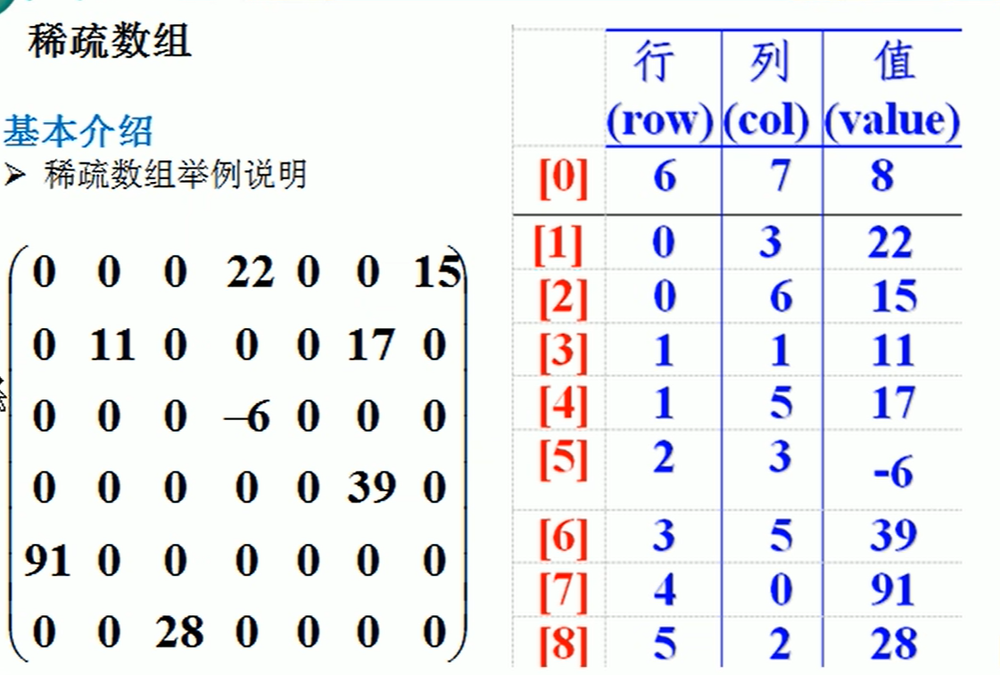
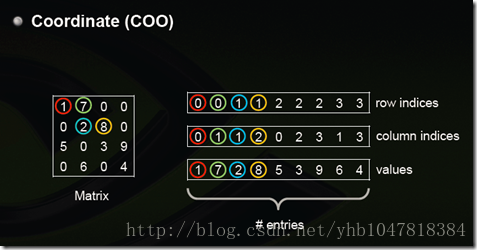
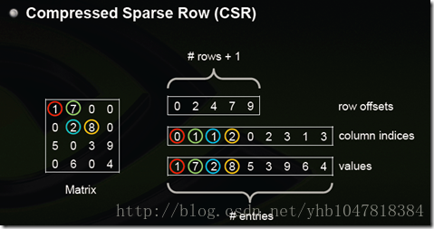

# 数据结构

## 稀疏矩阵

当一个数组中大部分元素为0，或者为同一个值的数组时，可以使用稀疏数组来保存该数组。相反，如果非零元素数目占大多数时，则称该矩阵为稠密矩阵

稀疏数组处理方法是：

1. 记录数组一共有几行几列，有多少个不同的值
2. 把具有不同值的元素的行列及值记录在一个小规模的数组中，从而缩小程序的规模

### COO存储格式

使用三个数组，分别存储全部非零元的行下标（row index）、列下标（column index）和值（value）

每个元素用一个三元组来表示，分别是（行号，列号，数值），对应上图右边的一列。空间不是最优。

### CSR存储格式

对下标进行压缩，假设矩阵行数是m，则压缩后的数组长度为m+1，记作（row ptr），其中第i个元素（0-base）表示矩阵前i行的非零元素个数

比较标准的一种，需要三类数据表达：数值，列号，以及行偏移。`CSR`不是三元组，而是整体的编码方式。数值和列号与`COO`一致，表示一个元素以及其列号，行偏移表示某一行的第一个元素在values里面的起始偏移位置。如上图中，第一行元素1是0偏移，第二行元素2是2偏移，第三行元素5是4偏移，第4行元素6是7偏移。在行偏移的最后补上矩阵总的元素个数，本例中是9。

## 队列

队列是一个有序列表，可以用数组或者链表来实现，遵循先入先出的原则