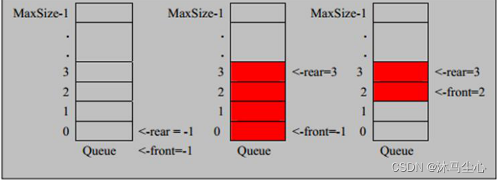
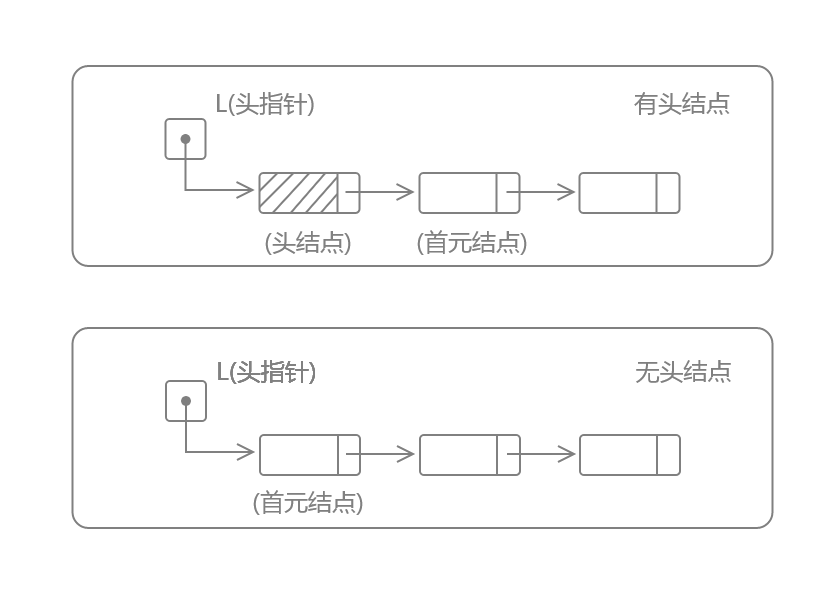

# 数据结构

## 稀疏矩阵

当一个数组中大部分元素为0，或者为同一个值的数组时，可以使用稀疏数组来保存该数组。相反，如果非零元素数目占大多数时，则称该矩阵为稠密矩阵

稀疏数组处理方法是：

1. 记录数组一共有几行几列，有多少个不同的值
2. 把具有不同值的元素的行列及值记录在一个小规模的数组中，从而缩小程序的规模


### COO存储格式

使用三个数组，分别存储全部非零元的行下标（row index）、列下标（column index）和值（value）


每个元素用一个三元组来表示，分别是（行号，列号，数值），对应上图右边的一列。空间不是最优。

### CSR存储格式

对下标进行压缩，假设矩阵行数是m，则压缩后的数组长度为m+1，记作（row ptr），其中第i个元素（0-base）表示矩阵前i行的非零元素个数


比较标准的一种，需要三类数据表达：数值，列号，以及行偏移。`CSR`不是三元组，而是整体的编码方式。数值和列号与`COO`一致，表示一个元素以及其列号，行偏移表示某一行的第一个元素在values里面的起始偏移位置。如上图中，第一行元素1是0偏移，第二行元素2是2偏移，第三行元素5是4偏移，第4行元素6是7偏移。在行偏移的最后补上矩阵总的元素个数，本例中是9。

## 队列

队列是一个有序列表，可以用数组或者链表来实现，遵循先入先出的原则



### 基于数组的队列

```golang
// 数组队列，先进先出
type ArrayQueue struct {
	maxsize int
	array   []string   // 底层切片
	size    int        // 队列的元素数量
	lock    sync.Mutex // 为了并发安全使用的锁
}

func NewArrayQueue(size int) *ArrayQueue {
	queue := new(ArrayQueue)
	queue.maxsize = size
	return queue
}
func (arrQueue *ArrayQueue) Add(v string) {
	arrQueue.lock.Lock()
	defer arrQueue.lock.Unlock()
	arrQueue.array = append(arrQueue.array, v)
	arrQueue.size += 1
}
func (arrQueue *ArrayQueue) Remove() string {
	arrQueue.lock.Lock()
	defer arrQueue.lock.Unlock()
	// 队中元素已空
	if arrQueue.size == 0 {
		panic("empty")
	}
	// 队列最前面元素
	v := arrQueue.array[0]
	/*    直接原位移动，但缩容后继的空间不会被释放
	      for i := 1; i < queue.size; i++ {
	          // 从第一位开始进行数据移动
	          queue.array[i-1] = queue.array[i]
	      }
	      // 原数组缩容
	      queue.array = queue.array[0 : queue.size-1]
	*/
	// 创建新的数组，移动次数过多
	newArray := make([]string, arrQueue.size-1)
	for i := 1; i < arrQueue.size; i++ {
		// 从老数组的第一位开始进行数据移动
		newArray[i-1] = arrQueue.array[i]
	}
	arrQueue.array = newArray

	// 队中元素数量-1
	arrQueue.size = arrQueue.size - 1
	return v
}
func (arrQueue *ArrayQueue) ShowQueue() {
	arrQueue.lock.Lock()
	defer arrQueue.lock.Unlock()
	for _, v := range arrQueue.array {
		fmt.Println(v)
	}
}
func (arrQueue *ArrayQueue) GetLength() int {
	arrQueue.lock.Lock()
	defer arrQueue.lock.Unlock()
	return arrQueue.size
}

```

### 基于数组实现循环队列

- 将数组看成是一个环形的（通过取模的方式来实现）


- 什么时候表示队列满 （tail+1）%maxSize==head


- 当tail==head时表示队列为空


- 初始化时，tail=0,head=0


- 统计该队列有多少个元素 (tail+maxSize-head)%maxSize


- tail在队列尾部，不包含最后的元素（见下面的‘注意’），head指向队首并且含队首元素
  

**代码实现**

```golang
type CircleQueue struct {
	maxsize int
	array   []string
	head    int
	tail    int
	lock    sync.Mutex
}
func NewCircleQueue(size int) *CircleQueue {
	temp := new(CircleQueue)
	temp.maxsize = size
	temp.array = make([]string, temp.maxsize, size)
	return temp
}
func (circle *CircleQueue) Add(v string) error {
	circle.lock.Lock()
	defer circle.lock.Unlock()
	//判断是否已经满了
	if circle.isFull() {
		return errors.New("full queue")
	}
	circle.array[circle.tail] = v
	circle.tail = (circle.tail + 1) % circle.maxsize
	return nil
}
func (circle *CircleQueue) Remove() (string, error) {
	circle.lock.Lock()
	defer circle.lock.Unlock()
	if circle.isEmpty() {
		return "", errors.New("empty queue")
	}
	value := circle.array[circle.head]
	circle.head = (circle.head + 1) % circle.maxsize
	return value, nil
}
func (circle *CircleQueue) ListCircleQueue() {
	fmt.Println("环形队列情况如下")
	//取出当前队列有多少个元素
	size := circle.Size()
	if size == 0 {
		fmt.Println("队列为空")
	}
	//设计一个辅助变量，指向head
	tempHead := circle.head
	for i := 0; i < size; i++ {
		fmt.Printf("arr[%d]=%s\t", tempHead, circle.array[tempHead])
		tempHead = (tempHead + 1) % circle.maxsize
	}
	fmt.Println()
}
func (circle *CircleQueue) isFull() bool {
	return (circle.tail+1)%circle.maxsize == circle.head
}
func (circle *CircleQueue) isEmpty() bool {
	return circle.tail == circle.head
}
func (circle *CircleQueue) Size() int {
	return (circle.tail + circle.maxsize - circle.head) % circle.maxsize
}
```

## 链表

### 单向链表

根节点一直存在，但是不存储任何信息

**结点(node)**

- **数据域**  => 存储元素信息
- **指针域**  => 存储结点的直接后继，也称作指针或链

**首元结点** 是指链表中存储的第一个数据元素的结点

**头结点** 是在首元结点之前附设的一个结点，其指针域指向首元结点(非必须)

**头指针** 是指向链表中第一个结点的指针



```go
type Element struct {
	data interface{}
	next *Element
}
type List struct {
	length int
	root   *Element
}

/*
单链表的初始化
1、生成新结点作为头结点，用头指针指向头结点
2、头结点的指针域置空
*/
func InitList() *List {
	element := new(Element)
	list := new(List)
	list.root = element
	return list
}

/*
在指定位置插入元素：根节点为0号节点,根节点一直存在，但是不保存数据
单链表的插入=>将值为e的新结点插入到表的第i个结点的位置上，即插入到结点a(i-1)与a(i)之间
1、查找结点a(i-1)并由指针p指向该结点
2、生成一个新结点*s
3、将新结点*s的数据域置为e
4、将新结点*s的指针域指向结点a(i)
5、将结点*p的指针域指向新结点*s
*/
func (l *List) InsertElem(index int, v interface{}) error {
	if index <= 0 || index > l.length {
		return errors.New("out of the length")
	}
	pre := l.root
	ele := &Element{data: v}
	if index == 1 {
		l.AddElem(v)
		return nil
	}
	for i := 0; i < index-1; i++ {
		pre = pre.next
	}
	ele.next = pre.next
	pre.next = ele
	l.length++
	return nil
}

// 添加在根节点后一个
func (l *List) AddElem(v interface{}) {
	ele := &Element{data: v}
	if l.isEmpty() {
		l.root.next = ele
	} else {
		ele.next = l.root.next
		l.root.next = ele
	}
	l.length++
}

// 添加在尾部
func (l *List) AppendElem(v interface{}) {
	ele := &Element{data: v}
	pre := l.root
	if l.isEmpty() {
		pre.next = ele
		return
	}
	for {
		if pre.next != nil {
			pre = pre.next
		} else {
			break
		}
	}
	pre.next = ele
	l.length++
}

// 获取链表长度
func (l *List) GetSize() int {
	return l.length
}

// 删除指定位置的节点
func (l *List) DeleteIndex(index int) {
	if l.isEmpty() {
		logrus.Error("empty list, need not delete")
		return
	}
	if index <= 0 || index > l.length {
		logrus.Errorln("out of the length")
		return
	}
	pre := l.root
	if index == 1 {
		next := pre.next.next
		del := pre.next
		pre.next = next
		del.next = nil
	} else {
		for count := 0; count < index-1; count++ {
			pre = pre.next
		}
		del := pre.next
		next := pre.next.next
		pre.next = next
		del.next = nil
	}
	l.length--
}

// 删除指定值的节点,仅删除找到的第一个值的节点
func (l *List) DeleteValue(v interface{}) {
	if l.isEmpty() {
		logrus.Error("empty list, need not delete")
		return
	}
	pre := l.root.next
	if pre.data == v {
		l.root.next = pre.next
		pre.next = nil
		return
	}
	for {
		if pre.next != nil {
			if pre.next.data == v {
				temp := pre.next.next
				target := pre.next
				pre.next = temp
				target.next = nil
				break
			} else {
				pre = pre.next
			}
		} else {
			logrus.Errorln("the data is not existing")
			break
		}
	}
	l.length--

}

// 查询是否包含指定值
func (l *List) IsContain(v interface{}) bool {
	pre := l.root
	for {
		if pre.next != nil {
			if pre.next.data == v {
				return true
			} else {
				pre = pre.next
			}
		} else {
			return false
		}
	}
}

// 查询指定位置的值,若不存在，返回空值
func (l *List) GetElem(index int) interface{} {
	if l.isEmpty() {
		return nil
	}
	if index <= 0 || index > l.length {
		return nil
	}
	pre := l.root
	for count := 0; count < index; count++ {
		pre = pre.next
	}
	return pre.data
}

// 遍历链表
func (l *List) ShowList() {
	if l.isEmpty() {
		logrus.Infoln("empty list")
	}
	pre := l.root.next
	for {
		if pre.next != nil {
			fmt.Print(pre.data, "=>")
			pre = pre.next
		} else {
			fmt.Println(pre.data, "=>", "nil")
			return
		}
	}
}
func (l *List) isEmpty() bool {
	return l.root.next == nil
}
```

### 双向链表

```go
// 节点
type Delement struct {
	data interface{}
	pre  *Delement
	next *Delement
}

// 双向链表
type DList struct {
	len    int
	header *Delement
	tail   *Delement
	lock   sync.Mutex
}

// 初始化新的链表
func NewDList() *DList {
	return &DList{
		len:    0,
		header: nil,
		tail:   nil,
		lock:   sync.Mutex{},
	}
}

// 向尾部添加数据
func (d *DList) Append(v interface{}) {
	d.lock.Lock()
	defer d.lock.Unlock()
	temp := &Delement{data: v}
	if d.isEmpty() {
		d.header = temp
		d.tail = temp
	} else {
		d.tail.next = temp
		temp.pre = d.tail
		d.tail = temp
	}
	d.len++
}

// 向头部添加数据
func (d *DList) AddHead(v interface{}) {
	d.lock.Lock()
	defer d.lock.Unlock()
	temp := &Delement{data: v}
	if d.isEmpty() {
		d.header = temp
		d.tail = temp
	} else {
		d.header.pre = temp
		temp.next = d.header
		d.header = temp
	}
	d.len++
}

// 从任意位置插入数据
// 如果链表本身为空，则忽视index，直接添加数据
// 如果输入的index不正确，则不做插入操作同时打印错误
func (d *DList) Insert(index int, v interface{}) {
	d.lock.Lock()
	defer d.lock.Unlock()
	temp := &Delement{data: v}
	if d.isEmpty() {
		logrus.Warnln("empty DList, ignore the index input")
		d.header = temp
		d.tail = temp
		d.len++
		return
	}
	if index >= d.len || index < 0 {
		logrus.Errorln("invalid index")
		return
	}
	if index == 0 {
		d.header.pre = temp
		temp.next = d.header
		d.header = temp
		d.len++
		return
	}
	if index == d.len-1 {
		d.tail.next = temp
		temp.pre = d.tail
		d.tail = temp
		d.len++
		return
	}
	if index <= (d.len / 2) {
		node := d.header
		for count := 0; count < index; count++ {
			node = node.next
		}
		temp.pre = node.pre
		temp.next = node
		node.pre = temp
	} else {
		node := d.tail
		for count := d.len - 1; count > index; count-- {
			node = node.pre
		}
		temp.pre = node.pre
		temp.next = node
		node.pre = temp
	}
	d.len++
}

// 从头部出队列
func (d *DList) Lpop() interface{} {
	d.lock.Lock()
	defer d.lock.Unlock()
	if d.isEmpty() {
		return nil
	}
	data := d.header.data
	d.header = d.header.next
	if d.header != nil {
		d.header.pre = nil
	} else {
		d.tail = nil
	}
	d.len--
	return data
}

// 从尾部出列
func (d *DList) Rpop() interface{} {
	d.lock.Lock()
	defer d.lock.Unlock()
	if d.isEmpty() {
		return nil
	}
	data := d.tail.data
	d.tail = d.tail.pre
	if d.tail != nil {
		d.tail.next = nil
	} else {
		d.header = nil
	}
	d.len--
	return data
}

// 根据index查找数据,头节点算是0号
func (d *DList) GetData(index int) interface{} {
	d.lock.Lock()
	defer d.lock.Unlock()
	if d.len == 0 || index >= d.len || index < 0 {
		return nil
	}
	if index <= (d.len / 2) {
		node := d.header
		for count := 0; count < index; count++ {
			node = node.next
		}
		return node.data
	} else {
		node := d.tail
		for count := d.len - 1; count > index; count-- {
			node = node.pre
		}
		return node.data
	}
}

// 根据index删除节点,头节点算是0号
func (d *DList) Delete(index int) {
	d.lock.Lock()
	defer d.lock.Unlock()
	if d.len == 0 || index >= d.len || index < 0 {
		return
	}
	if index == 0 {
		d.header = d.header.next
		if d.header != nil {
			d.header.pre = nil
		} else {
			d.tail = nil
		}
		d.len--
		return
	}
	if index == d.len-1 {
		d.tail = d.tail.pre
		if d.tail != nil {
			d.tail.next = nil
		} else {
			d.header = nil
		}
		d.len--
		return
	}
	if index <= (d.len / 2) {
		node := d.header
		for count := 0; count < index; count++ {
			node = node.next
		}
		before := node.pre
		next := node.next
		before.next = next
		next.pre = before
		node.next = nil
		node.pre = nil
		d.len--
		return
	} else {
		node := d.tail
		for count := d.len - 1; count > index; count-- {
			node = node.pre
		}
		before := node.pre
		next := node.next
		before.next = next
		next.pre = before
		node.next = nil
		node.pre = nil
		d.len--
		return
	}
}

// 打印所有元素
func (d *DList) PrintAll() {
	if d.header == nil {
		return
	}
	i := 1
	curr := d.header
	for curr != nil {
		fmt.Printf("%d => %+v\n", i, curr.data)
		i++
		curr = curr.next
	}
}

// 判断链表是否为空
func (d *DList) isEmpty() bool {
	return d.len == 0
}
```

### 双向循环链表

```go
type Ring struct {
	pre, next *Ring
	Data      interface{}
}

// 创建一个新的空循环链表
func (r *Ring) init() *Ring {
	r.next = r
	r.pre = r
	r.Data = nil
	return r
}

// 创建一个指定大小的空的循环链表
func New(n int) *Ring {
	if n <= 0 {
		return nil
	}
	r := new(Ring)
	p := r
	for i := 1; i < n; i++ {
		p.next = &Ring{pre: p}
		p = p.next
	}
	p.next = r
	r.pre = p
	return r
}

// 获取下一个节点
func (r *Ring) Next() *Ring {
	if r.next == nil {
		return r.init()
	}
	return r.next
}

// 获取上一个节点
func (r *Ring) Pre() *Ring {
	if r.pre == nil {
		return r.init()
	}
	return r.pre
}

// 获取第n个节点，如果n为负数，则反向查找,如果n==0,则返回当前节点
func (r *Ring) Move(n int) *Ring {
	if r.next == nil {
		return r.init()
	}
	switch {
	case n > 0:
		for ; n > 0; n-- {
			r = r.next
		}
	case n < 0:
		for ; n < 0; n++ {
			r = r.pre
		}
	}
	return r
}

// 往节点A，链接一个节点，并且返回之前节点A的后驱节点
func (r *Ring) Link(s *Ring) *Ring {
	n := r.Next()
	if s != nil {
		p := s.Pre()
		r.next = s
		s.pre = r
		n.pre = p
		p.next = n
	}
	return n
}

// 删除节点后面的 n 个节点
func (r *Ring) Unlink(n int) *Ring {
	if n < 0 {
		return nil
	}
	return r.Link(r.Move(n + 1))
}

// 查看循环链表长度
func (r *Ring) Len() int {
	n := 0
	if r != nil {
		n = 1
		for p := r.Next(); p != r; p = p.next {
			n++
		}
	}
	return n
}
```

