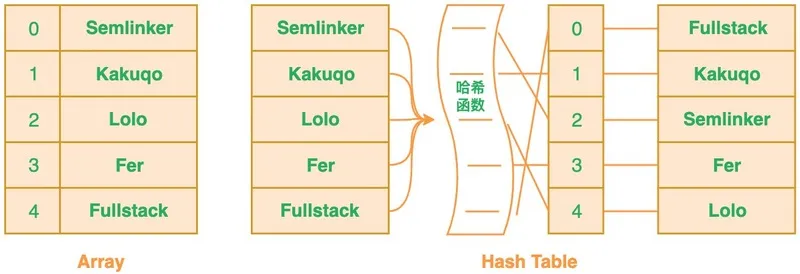
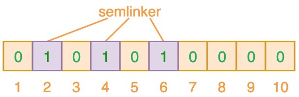
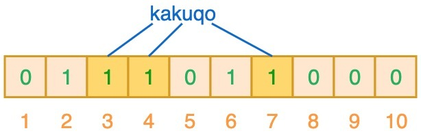
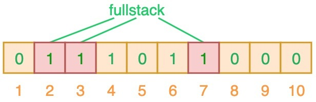
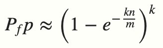
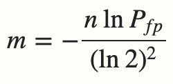

# 琐碎知识点

## 连接池

对于一个简单的数据库引用，用于对数据库的访问不是很频繁，这种情况可以简单的在需要访问数据库时，创建一个链接，用完关闭它，这样做不会有太明显的性能上的开销。但是对于复杂的数据库引用，情况就截然不同了，频繁的建立、关闭连接，会极大的减低系统的性能，这是对于连接的使用造成系统性能的瓶颈。

### 连接池的作用：

连接池的作用是为了提高性能，避免重复多次的打开数据库连接而曹诚性能的下降和系统资源的浪费；连接池是将已经创建好的连接保存在池中，当有请求来时，直接使用已经创建好的连接对数据库进行访问。这样省略了创建和销毁的过程。这样以提高系统的性能。

### 连接池基本原理：

1、建立数据库连接池对象（服务器启动）。

2、按照事先指定的参数创建对应初始数量的数据库连接（即空闲连接），设置连接池连接数量极值（最大活跃链接）。

3、对于一个数据库的访问请求，直接从连接池中得到一个连接。如果数据库连接池对象中没有空闲连接，且数量没有达到极值（即：最大活跃链接），创建一个新的数据库连接。

4、存取数据库。

5、关闭数据库，释放大于初始数量的空闲数据库连接。（并非真正关闭，而是将其放入空闲队列中。如实际空闲连接大于初始数量空闲连接则释放连接）。

6、释放数据库连接池对象（服务器停止、维护期间，释放数据库连接池对象，并释放所有连接）。

使用连接池的优势：
1、资源复用：由于数据库连接得到重用，避免了频繁创建、释放引起的大量性能开销。在减少系统消耗的基础上，在另一方面也增进了系统运行环境的平稳性（减少内存碎片及数据库临时进程/线程的数量）

2、更快的系统响应速度：数据库连接池在初始化过程中，往往已经创建了若干个数据库连接置于池中备用，此时连接的初始化工作均已完成。对于业务请求处理而言，直接利用现有的可用连接，避免了数据库连接初始化和释放过程的时间，从而缩减了系统整体相应时间。

3、统一的连接管理，避免数据库连接泄露：在较为完备的数据库连接池实现中，可根据预先的连接占用超时设定，强制收回被占用连接，从而避免了常规数据库连接操作中可能出现的额资源泄露。

### 应用连接池的三种方式：

1、自定义连接池

2、使用第三方连接池

3、使用服务器自带的连接池

解惑：
为什么频繁建立、关闭连接会降低系统的性能：数据库连接是一项有限的昂贵资源，一个数据库连接对象均对应一个物理数据库连接，每次使用都要打开一个物理连接，使用完都关闭。建立数据库连接时非常耗费资源和时间的，首先要建立TCP连接；然后TCP协议三次握手的发送与响应；客户端的账户验证，服务器返回确认；用户验证后，需要传输相关链接变量如是否自动提交事务的设置等，会有很多次的数据交互，然后才能建立连接。

## 布隆过滤器

在程序的世界中，布隆过滤器是程序员的一把利器，利用它可以快速地解决项目中一些比较棘手的问题。如网页 URL 去重、垃圾邮件识别、大集合中重复元素的判断和缓存穿透等问题。

布隆过滤器（Bloom Filter）是 1970 年由布隆提出的。它实际上是一个很长的二进制向量和一系列随机映射函数。布隆过滤器可以用于检索一个元素是否在一个集合中。**它的优点是空间效率和查询时间都比一般的算法要好的多，缺点是有一定的误识别率和删除困难**。

### 布隆过滤器简介

当你往简单数组或列表中插入新数据时，将不会根据插入项的值来确定该插入项的索引值。这意味着新插入项的索引值与数据值之间没有直接关系。这样的话，当你需要在数组或列表中搜索相应值的时候，你必须遍历已有的集合。若集合中存在大量的数据，就会影响数据查找的效率。

针对这个问题，你可以考虑使用哈希表。**利用哈希表你可以通过对 “值” 进行哈希处理来获得该值对应的键或索引值**，然后把该值存放到列表中对应的索引位置。这意味着索引值是由插入项的值所确定的，当你需要判断列表中是否存在该值时，只需要对值进行哈希处理并在相应的索引位置进行搜索即可，这时的搜索速度是非常快的。





根据定义，布隆过滤器可以检查值是 **“可能在集合中”** 还是 **“绝对不在集合中”**。“可能” 表示有一定的概率，也就是说可能存在一定为误判率。那为什么会存在误判呢？下面我们来分析一下具体的原因。

布隆过滤器（Bloom Filter）本质上是由长度为 m 的位向量或位列表（仅包含 0 或 1 位值的列表）组成，最初所有的值均设置为 0，如下图所示。


为了将数据项添加到布隆过滤器中，我们会提供 K 个不同的哈希函数，并将结果位置上对应位的值置为 “1”。在前面所提到的哈希表中，我们使用的是单个哈希函数，因此只能输出单个索引值。而对于布隆过滤器来说，我们将使用多个哈希函数，这将会产生多个索引值。





如上图所示，当输入 “semlinker” 时，预设的 3 个哈希函数将输出 2、4、6，我们把相应位置 1。假设另一个输入 ”kakuqo“，哈希函数输出 3、4 和 7。你可能已经注意到，索引位 4 已经被先前的 “semlinker” 标记了。此时，我们已经使用 “semlinker” 和 ”kakuqo“ 两个输入值，填充了位向量。当前位向量的标记状态为：





当对值进行搜索时，与哈希表类似，我们将使用 3 个哈希函数对 ”搜索的值“ 进行哈希运算，并查看其生成的索引值。假设，当我们搜索 ”fullstack“ 时，3 个哈希函数输出的 3 个索引值分别是 2、3 和 7：





从上图可以看出，相应的索引位都被置为 1，这意味着我们可以说 ”fullstack“ 可能已经插入到集合中。事实上这是误报的情形，产生的原因是由于哈希碰撞导致的巧合而将不同的元素存储在相同的比特位上。幸运的是，布隆过滤器有一个可预测的误判率（FPP）：





- n 是已经添加元素的数量；
- k 哈希的次数；
- m 布隆过滤器的长度（如比特数组的大小）；

极端情况下，当布隆过滤器没有空闲空间时（满），每一次查询都会返回 true 。这也就意味着 m 的选择取决于期望预计添加元素的数量 n ，并且 m 需要远远大于 n 。

实际情况中，布隆过滤器的长度 m 可以根据给定的误判率（FFP）的和期望添加的元素个数 n 的通过如下公式计算：





了解完上述的内容之后，我们可以得出一个结论，**当我们搜索一个值的时候，若该值经过 K 个哈希函数运算后的任何一个索引位为 ”0“，那么该值肯定不在集合中。但如果所有哈希索引值均为 ”1“，则只能说该搜索的值可能存在集合中**。

### 布隆过滤器应用

在实际工作中，布隆过滤器常见的应用场景如下：

- 网页爬虫对 URL 去重，避免爬取相同的 URL 地址；
- 反垃圾邮件，从数十亿个垃圾邮件列表中判断某邮箱是否垃圾邮箱；
- Google Chrome 使用布隆过滤器识别恶意 URL；
- Medium 使用布隆过滤器避免推荐给用户已经读过的文章；
- Google BigTable，Apache HBbase 和 Apache Cassandra 使用布隆过滤器减少对不存在的行和列的查找。 除了上述的应用场景之外，布隆过滤器还有一个应用场景就是解决缓存穿透的问题。所谓的缓存穿透就是服务调用方每次都是查询不在缓存中的数据，这样每次服务调用都会到数据库中进行查询，如果这类请求比较多的话，就会导致数据库压力增大，这样缓存就失去了意义。

利用布隆过滤器我们可以预先把数据查询的主键，比如用户 ID 或文章 ID 缓存到过滤器中。当根据 ID 进行数据查询的时候，我们先判断该 ID 是否存在，若存在的话，则进行下一步处理。若不存在的话，直接返回，这样就不会触发后续的数据库查询。需要注意的是缓存穿透不能完全解决，我们只能将其控制在一个可以容忍的范围内。

## `RLP`编码

### `RLP`编码定义

`RLP`（Recursive Length Prefix）即**递归长度前缀编码**， 不定义任何指定的数据类型， 仅以嵌套数组的形式存储结构。

`RLP`简化了编码的类型，只定义了两种类型编码：

- 字符串（byte数组）
- 字符串（byte数组）的数组，也就是`列表`.

### `RLP`编码规则;

**规则一:**

对于值在[0, 127]（十六进制[0x00, 0x7f]）之间的单个字节，其编码是其本身；无需前缀。

```css
a的编码是97
```

**规则二:**

如果字符串的长度为0-55个字节之间，编码的结果是数组本身，再加上`0x80 + 字符串长度`作为前缀， 前缀范围是：[0x80, 0xb7] 即十进制[128, 183]。

```go
空字符串的编码是128，即 128=128+0
abc的编码是131 97 98 99，其实131=128+len("abc"), 97 98 99依次是`a b c`
```

**规则三:**

如果字符串（数组）长度大于55字节，编码结果第一个值是183（128+55）+ `数组长度的编码的字节长度`，然后是数组长度本身的编码，最后是byte数组的编码（共三个部分）。前缀范围是：[0xb8, 0xbf] 即十进制[184, 191]。

```solidity
编码一个重复1024次"a"的字符串，其结果是`185 4 0 97 97 97 ...
```

1024（2的10次方）按照大端编码是`0000 0000 001`转换为十六进制是`0 0 4 0`，省略前面的`0`,长度为`2`， 因此`185 = 183 + 2`

> 大端编码(`BigEndian`): 低字节在高内存地址 ; 小端编码(`LittleEndian`): 低字节在低内存地址

**规则四**

如果列表总内容`RLP`编码后字节长度小于55，编码结果第一位是`192` + `列表内容编码的长度`，然后依次连接各个子列表的编码，前缀范围是：[`0xc0`,` 0xf7`] 即十进制[192,247]。

```css
空列表[]编码结果为：192
["abc", "def"]的编码结果是 200 131 97 98 99 131 100 101 102
```

其中`abc`的编码是`131 97 98 99`, `131 = 128 + len("abc")` ， abc的编码长度是4，同样`def`的编码是`131 100 101 102`，编码长度是4，两个子字符串的编码后总长度为8，编码结果的第一位 `200 = 192 + 8`

**规则五**

如果总内容RLP编码后字节长度超过55，编码结果第一位是`0xf7` + `列表长度的编码长度`，然后是列表长度本身的编码，最后依次连接子列表的编码，前缀范围是：[0xf8, 0xff] 即十进制[247,255]。

```css
["The length of this sentence is more than 55 bytes, ", "I know it because I pre-designed it"]
```

其中前两个字节的计算方式如下：

```markdown
1. "The length of this sentence is more than 55 bytes, "的长度为51(0x33)，根据规则二得出前缀179 （0xb3 = 0x80 + 0x33 ）
2. "I know it because I pre-designed it"的长度为35(0x23)，根据规则2得出前缀163 （0xa3 = 0x80 + 0x33)
3. 列表长度本身的编码为：51 + 35 + 2(个子串的前缀占用) = 88 （0x58）
4. 最后根据规则5，0x58只占用一个字节，即 247(0xf7) + 1 = 248 ， 前缀为 248。
```

的编码结果表示是:

```undefined
248 88 179 84 104 101 32 108 101 110 103 116 104 32 111 102 32 116 104 105 115 32 115 101 110 116 101 110 99 101 32 105 115 32 109 111 114 101 32 116 104 97 110 32 53 53 32 98 121 116 101 115 44 32 163 73 32 107 110 111 119 32 105 116 32 98 101 99 97 117 115 101 32 73 32 112 114 101 45 100 101 115 105 103 110 101 100 32 105 116
```

其中规则三，规则四，规则5是递归定义的（允许嵌套）。

